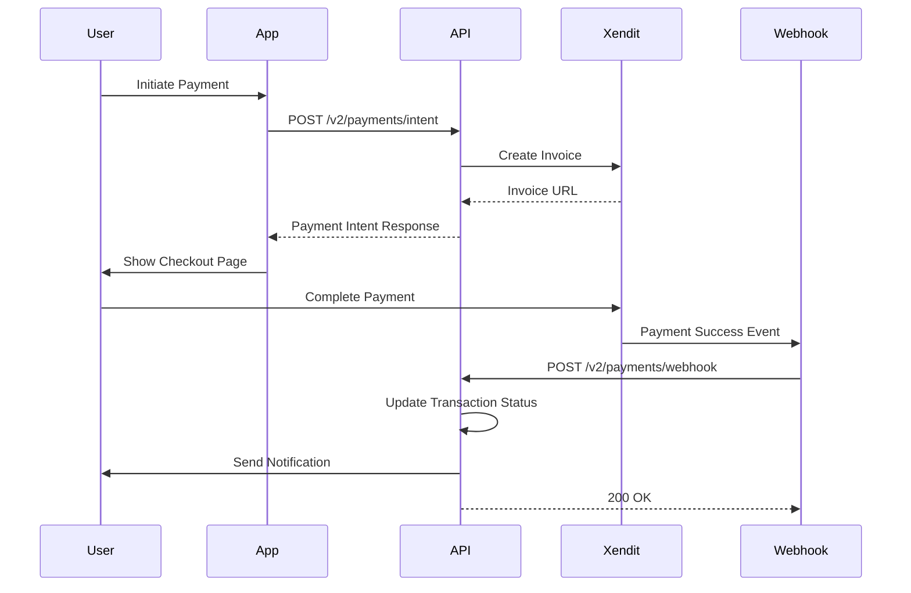

# Payment API Documentation

**Version:** 2.0  
**Base URL:** `/v2/payments`  
**Authentication:** Required (JWT Bearer Token)

---

## Table of Contents

- [Overview](#overview)
- [Payment Flow](#payment-flow)
- [Endpoints](#endpoints)
  - [Create Payment Intent](#create-payment-intent)
  - [Confirm Payment](#confirm-payment)
  - [Get Transaction](#get-transaction)
  - [List Transactions](#list-transactions)
  - [Capture Payment](#capture-payment)
  - [Refund Payment](#refund-payment)
  - [Calculate Fees](#calculate-fees)
  - [Payment Methods](#payment-methods)
  - [Payouts](#payouts)
  - [Webhooks](#webhooks)
- [Data Models](#data-models)
- [Error Codes](#error-codes)
- [Examples](#examples)

---

## Overview

The Payment API provides comprehensive payment processing capabilities using Xendit as the primary payment gateway for the Malaysian market. It supports:

- **Payment Methods:** Cards, e-wallets (GrabPay, ShopeePay, etc.), bank transfers, QR codes
- **Currencies:** MYR (primary), SGD, IDR, PHP, THB, VND, USD
- **Transaction Types:** Event tickets, marketplace orders, service bookings, subscriptions, donations
- **Features:** Fee calculations, refunds, saved payment methods, payout distribution

---

## Payment Flow

### Standard Payment Flow



### Key Steps

1. **Create Payment Intent** - Initialize payment and get checkout URL
2. **User Checkout** - User completes payment on Xendit page
3. **Webhook Notification** - Xendit notifies your server of payment status
4. **Confirm Payment** - Optionally check status manually
5. **Payout Distribution** - System distributes funds to recipients

---

## Endpoints

### Create Payment Intent

Create a new payment intent and receive a checkout URL for the user.

**Endpoint:** `POST /v2/payments/intent`

**Request Body:**

```json
{
  "amount": 100.00,
  "currency": "MYR",
  "transactionType": "EVENT_TICKET",
  "referenceType": "event_ticket",
  "referenceId": "evt_abc123",
  "description": "Concert ticket - VIP Section",
  "metadata": {
    "eventName": "Summer Festival 2025",
    "seatNumber": "A-15"
  }
}
```

**Parameters:**

| Field | Type | Required | Description |
|-------|------|----------|-------------|
| `amount` | number | Yes | Payment amount (min: 1.00) |
| `currency` | string | No | Currency code (default: MYR) |
| `transactionType` | enum | Yes | Type of transaction (see Transaction Types) |
| `referenceType` | string | Yes | Reference entity type |
| `referenceId` | string | Yes | ID of referenced entity |
| `description` | string | No | Payment description |
| `metadata` | object | No | Additional metadata |
| `providerId` | string | No | Specific payment provider ID |

**Transaction Types:**
- `EVENT_TICKET` - Event ticket purchases
- `MARKETPLACE_ORDER` - Marketplace transactions
- `SERVICE_BOOKING` - Service bookings
- `SUBSCRIPTION` - Subscription payments
- `DONATION` - Donations

**Response:**

```json
{
  "success": true,
  "data": {
    "transactionId": "txn_abc123",
    "clientSecret": "https://checkout-staging.xendit.co/web/inv_xyz789",
    "amount": 100,
    "currency": "MYR",
    "status": "PENDING",
    "providerId": "prov_xendit_001",
    "expiresAt": "2025-10-19T12:00:00.000Z"
  },
  "message": "Payment intent created successfully"
}
```

**Client Implementation:**

```javascript
// 1. Create payment intent
const response = await fetch('/v2/payments/intent', {
  method: 'POST',
  headers: {
    'Authorization': `Bearer ${token}`,
    'Content-Type': 'application/json'
  },
  body: JSON.stringify({
    amount: 100.00,
    currency: 'MYR',
    transactionType: 'EVENT_TICKET',
    referenceType: 'event_ticket',
    referenceId: 'evt_abc123'
  })
});

const { data } = await response.json();

// 2. Redirect user to checkout
window.location.href = data.clientSecret;

// 3. Handle return from checkout (optional)
// User is redirected to your success/failure URL
```

---

### Confirm Payment

Manually check the status of a payment.

**Endpoint:** `POST /v2/payments/confirm`

**Request Body:**

```json
{
  "transactionId": "txn_abc123",
  "gatewayTransactionId": "inv_xyz789"
}
```

**Response:**

```json
{
  "success": true,
  "data": {
    "id": "txn_abc123",
    "status": "SUCCEEDED",
    "amount": 100,
    "currency": "MYR",
    "processedAt": "2025-10-18T12:30:00.000Z",
    "gatewayTransactionId": "inv_xyz789",
    "platformFee": 11,
    "gatewayFee": 4.4,
    "totalFees": 15.4,
    "netAmount": 84.6
  }
}
```

---

### Get Transaction

Retrieve details of a specific transaction.

**Endpoint:** `GET /v2/payments/:transactionId`

**Response:**

```json
{
  "success": true,
  "data": {
    "id": "txn_abc123",
    "userId": "user_123",
    "transactionType": "EVENT_TICKET",
    "referenceType": "event_ticket",
    "referenceId": "evt_abc123",
    "amount": 100,
    "currency": "MYR",
    "platformFee": 11,
    "gatewayFee": 4.4,
    "totalFees": 15.4,
    "netAmount": 84.6,
    "status": "SUCCEEDED",
    "providerId": "prov_xendit_001",
    "providerName": "Xendit",
    "gatewayTransactionId": "inv_xyz789",
    "description": "Concert ticket - VIP Section",
    "createdAt": "2025-10-18T12:00:00.000Z",
    "processedAt": "2025-10-18T12:30:00.000Z"
  }
}
```

---

### List Transactions

Retrieve a paginated list of user transactions with filters.

**Endpoint:** `GET /v2/payments/transactions`

**Query Parameters:**

| Parameter | Type | Description |
|-----------|------|-------------|
| `page` | number | Page number (default: 1) |
| `limit` | number | Items per page (default: 20, max: 100) |
| `status` | enum | Filter by status (PENDING, SUCCEEDED, FAILED, etc.) |
| `transactionType` | enum | Filter by transaction type |
| `startDate` | ISO 8601 | Start date filter |
| `endDate` | ISO 8601 | End date filter |
| `minAmount` | number | Minimum amount filter |
| `maxAmount` | number | Maximum amount filter |
| `providerId` | string | Filter by payment provider |

**Response:**

```json
{
  "success": true,
  "data": {
    "transactions": [
      {
        "id": "txn_abc123",
        "amount": 100,
        "status": "SUCCEEDED",
        "createdAt": "2025-10-18T12:00:00.000Z"
      }
    ],
    "totalCount": 45,
    "page": 1,
    "limit": 20,
    "totalPages": 3,
    "summary": {
      "totalAmount": 4500,
      "totalFees": 693,
      "totalRefunded": 100,
      "successCount": 40,
      "pendingCount": 3,
      "failedCount": 2
    }
  }
}
```

---

### Capture Payment

Capture an authorized payment (for two-step flows).

**Endpoint:** `POST /v2/payments/:transactionId/capture`

**Request Body:**

```json
{
  "amount": 100.00
}
```

**Response:**

```json
{
  "success": true,
  "data": {
    "id": "txn_abc123",
    "status": "SUCCEEDED",
    "amount": 100,
    "capturedAt": "2025-10-18T12:30:00.000Z"
  }
}
```

---

### Refund Payment

Issue a full or partial refund for a completed payment.

**Endpoint:** `POST /v2/payments/:transactionId/refund`

**Request Body:**

```json
{
  "amount": 50.00,
  "reason": "Customer requested cancellation"
}
```

**Parameters:**

| Field | Type | Required | Description |
|-------|------|----------|-------------|
| `amount` | number | No | Refund amount (default: full refund) |
| `reason` | string | Yes | Reason for refund |

**Response:**

```json
{
  "success": true,
  "data": {
    "id": "txn_abc123",
    "status": "PARTIALLY_REFUNDED",
    "refundedAmount": 50,
    "refundedAt": "2025-10-18T13:00:00.000Z",
    "refundReason": "Customer requested cancellation"
  }
}
```

---

### Calculate Fees

Calculate platform and gateway fees before creating a payment.

**Endpoint:** `POST /v2/payments/calculate-fees`

**Authentication:** Optional (Public endpoint)

**Request Body:**

```json
{
  "amount": 100.00,
  "transactionType": "EVENT_TICKET",
  "providerId": "prov_xendit_001"
}
```

**Response:**

```json
{
  "success": true,
  "data": {
    "platformFee": 11.00,
    "gatewayFee": 4.40,
    "totalFees": 15.40,
    "netAmount": 84.60,
    "feeBreakdown": {
      "platformFeePercentage": 11,
      "platformFeeFixed": 0,
      "gatewayFeePercentage": 2.9,
      "gatewayFeeFixed": 1.50
    }
  }
}
```

---

### Payment Methods

#### Add Payment Method

Save a tokenized payment method for future use.

**Endpoint:** `POST /v2/payments/methods`

**Request Body:**

```json
{
  "provider": "xendit",
  "type": "card",
  "gatewayMethodId": "pm_abc123",
  "lastFour": "4242",
  "expiryMonth": 12,
  "expiryYear": 2025,
  "isDefault": true
}
```

**Response:**

```json
{
  "success": true,
  "data": {
    "id": "pm_xyz789",
    "provider": "xendit",
    "type": "card",
    "lastFour": "4242",
    "expiryMonth": 12,
    "expiryYear": 2025,
    "isDefault": true,
    "createdAt": "2025-10-18T12:00:00.000Z"
  }
}
```

#### List Payment Methods

**Endpoint:** `GET /v2/payments/methods`

**Response:**

```json
{
  "success": true,
  "data": [
    {
      "id": "pm_xyz789",
      "type": "card",
      "lastFour": "4242",
      "isDefault": true
    }
  ]
}
```

#### Update Payment Method

**Endpoint:** `PUT /v2/payments/methods/:methodId`

**Request Body:**

```json
{
  "isDefault": true
}
```

#### Delete Payment Method

**Endpoint:** `DELETE /v2/payments/methods/:methodId`

---

### Payouts

#### List Payouts

Retrieve payout distribution history.

**Endpoint:** `GET /v2/payments/payouts`

**Query Parameters:**

| Parameter | Type | Description |
|-----------|------|-------------|
| `page` | number | Page number |
| `limit` | number | Items per page |
| `status` | enum | PENDING, PROCESSING, RELEASED, FAILED |
| `startDate` | ISO 8601 | Start date filter |
| `endDate` | ISO 8601 | End date filter |

**Response:**

```json
{
  "success": true,
  "data": {
    "payouts": [
      {
        "id": "payout_123",
        "paymentTransactionId": "txn_abc123",
        "amount": 84.60,
        "currency": "MYR",
        "status": "RELEASED",
        "releaseDate": "2025-10-25T12:00:00.000Z",
        "releasedAt": "2025-10-25T12:05:00.000Z"
      }
    ],
    "totalCount": 12,
    "page": 1,
    "limit": 20,
    "totalPages": 1,
    "summary": {
      "totalAmount": 1015.20,
      "pendingAmount": 169.20,
      "completedAmount": 846.00
    }
  }
}
```

---

### Webhooks

#### Handle Webhook

Process payment provider webhook events.

**Endpoint:** `POST /v2/payments/webhooks/:provider`

**Authentication:** None (signature verified)

**Request Headers:**

```
x-callback-token: <webhook_verification_token>
x-xendit-signature: <hmac_signature>
```

**Request Body:**

```json
{
  "event": "invoice.paid",
  "data": {
    "id": "inv_xyz789",
    "status": "PAID",
    "amount": 100
  }
}
```

**Response:**

```json
{
  "success": true,
  "message": "Webhook processed"
}
```

---

## Data Models

### PaymentStatus Enum

- `PENDING` - Initial state after creation
- `PROCESSING` - Payment submitted, awaiting confirmation
- `SUCCEEDED` - Payment completed successfully
- `FAILED` - Payment failed
- `CANCELED` - Payment cancelled or expired
- `REFUNDED` - Fully refunded
- `PARTIALLY_REFUNDED` - Partially refunded

### TransactionType Enum

- `EVENT_TICKET` - Event ticket purchases
- `MARKETPLACE_ORDER` - Marketplace transactions
- `SERVICE_BOOKING` - Service bookings
- `SUBSCRIPTION` - Subscription payments
- `DONATION` - Donations
- `REFUND` - Refund transactions

### PayoutStatus Enum

- `PENDING` - Awaiting release date
- `PROCESSING` - Being processed
- `RELEASED` - Successfully released
- `HELD` - On hold
- `FAILED` - Payout failed
- `CANCELED` - Payout cancelled

---

## Error Codes

| Code | Message | Description |
|------|---------|-------------|
| 400 | Invalid request | Request validation failed |
| 401 | Unauthorized | Missing or invalid authentication |
| 403 | Forbidden | Insufficient permissions |
| 404 | Not found | Transaction or resource not found |
| 409 | Conflict | Transaction already processed |
| 422 | Unprocessable entity | Business logic validation failed |
| 500 | Internal server error | Server error occurred |

### Error Response Format

```json
{
  "success": false,
  "error": "Transaction not found",
  "code": "TRANSACTION_NOT_FOUND"
}
```

---

## Examples

### Complete Payment Flow

```javascript
// 1. Calculate fees (optional)
const feesResponse = await fetch('/v2/payments/calculate-fees', {
  method: 'POST',
  headers: { 'Content-Type': 'application/json' },
  body: JSON.stringify({
    amount: 100.00,
    transactionType: 'EVENT_TICKET',
    providerId: 'prov_xendit_001'
  })
});

const fees = await feesResponse.json();
console.log(`Total fees: MYR ${fees.data.totalFees}`);

// 2. Create payment intent
const intentResponse = await fetch('/v2/payments/intent', {
  method: 'POST',
  headers: {
    'Authorization': `Bearer ${token}`,
    'Content-Type': 'application/json'
  },
  body: JSON.stringify({
    amount: 100.00,
    currency: 'MYR',
    transactionType: 'EVENT_TICKET',
    referenceType: 'event_ticket',
    referenceId: 'evt_123',
    description: 'VIP Concert Ticket'
  })
});

const intent = await intentResponse.json();

// 3. Redirect to checkout
window.location.href = intent.data.clientSecret;

// 4. After payment (on your success page)
const confirmResponse = await fetch('/v2/payments/confirm', {
  method: 'POST',
  headers: {
    'Authorization': `Bearer ${token}`,
    'Content-Type': 'application/json'
  },
  body: JSON.stringify({
    transactionId: intent.data.transactionId,
    gatewayTransactionId: intent.data.gatewayTransactionId
  })
});

const confirmation = await confirmResponse.json();
if (confirmation.data.status === 'SUCCEEDED') {
  console.log('Payment successful!');
}
```

### Refund Flow

```javascript
// Issue partial refund
const refundResponse = await fetch(`/v2/payments/${transactionId}/refund`, {
  method: 'POST',
  headers: {
    'Authorization': `Bearer ${token}`,
    'Content-Type': 'application/json'
  },
  body: JSON.stringify({
    amount: 50.00,
    reason: 'Customer requested partial refund'
  })
});

const refund = await refundResponse.json();
console.log(`Refunded: MYR ${refund.data.refundedAmount}`);
```

### Transaction Filtering

```javascript
// Get successful transactions from last 30 days
const startDate = new Date();
startDate.setDate(startDate.getDate() - 30);

const response = await fetch(
  `/v2/payments/transactions?` + new URLSearchParams({
    status: 'SUCCEEDED',
    startDate: startDate.toISOString(),
    page: 1,
    limit: 50
  }),
  {
    headers: { 'Authorization': `Bearer ${token}` }
  }
);

const transactions = await response.json();
console.log(`Total: MYR ${transactions.data.summary.totalAmount}`);
```

---

## Best Practices

### Security

1. **Always use HTTPS** in production
2. **Validate webhook signatures** to ensure authenticity
3. **Don't expose API keys** in client-side code
4. **Use environment variables** for sensitive configuration
5. **Implement rate limiting** to prevent abuse

### Error Handling

```javascript
try {
  const response = await fetch('/v2/payments/intent', {
    method: 'POST',
    headers: {
      'Authorization': `Bearer ${token}`,
      'Content-Type': 'application/json'
    },
    body: JSON.stringify(paymentData)
  });

  if (!response.ok) {
    const error = await response.json();
    throw new Error(error.error || 'Payment failed');
  }

  const result = await response.json();
  return result.data;
} catch (error) {
  console.error('Payment error:', error);
  // Show user-friendly error message
  showErrorToUser('Unable to process payment. Please try again.');
}
```

### Idempotency

For critical operations, use idempotency keys to prevent duplicate processing:

```javascript
const idempotencyKey = `payment-${userId}-${Date.now()}`;

fetch('/v2/payments/intent', {
  method: 'POST',
  headers: {
    'Authorization': `Bearer ${token}`,
    'Content-Type': 'application/json',
    'Idempotency-Key': idempotencyKey
  },
  body: JSON.stringify(paymentData)
});
```

---

## Testing

### Test Cards (Xendit)

| Card Number | Scenario |
|-------------|----------|
| `4000000000000002` | Successful payment |
| `4000000000000010` | Payment declined |
| `4000000000000028` | Expired card |
| `4000000000000036` | Insufficient funds |

### Test Credentials

```env
XENDIT_SECRET_KEY=xnd_development_...
XENDIT_ENVIRONMENT=test
```

### Test Webhook

```bash
curl -X POST http://localhost:3001/v2/payments/webhooks/xendit \
  -H "Content-Type: application/json" \
  -H "x-callback-token: your_webhook_token" \
  -d '{
    "event": "invoice.paid",
    "data": {
      "id": "inv_test_123",
      "status": "PAID",
      "amount": 100
    }
  }'
```

---

## Support

**Questions?** Contact the development team or refer to:
- Xendit Documentation: https://developers.xendit.co
- Internal Slack: #payment-support
- Email: dev@berse.app

**Last Updated:** October 18, 2025
