# Trust Chain Integration Plan for Berse App

## Current App Analysis

### Existing Structure
- **Frontend**: React/TypeScript with Material-UI components
- **Key Pages**: BerseMatch, BerseConnect, Profile screens
- **Current Features**: Events, networking, profile management
- **Styling**: Styled-components with Material-UI theme

### Identified Integration Points

## 🎯 Phase 1: Core Trust Chain Infrastructure (Weeks 1-3)

### Backend API Endpoints
**New endpoints to add:**

```typescript
// Trust Chain Management
POST /api/v1/trust/vouch-request        // Request a vouch
PUT  /api/v1/trust/vouch-response       // Approve/reject vouch
GET  /api/v1/trust/chains/:userId       // Get user's trust chain
DELETE /api/v1/trust/revoke/:chainId    // Revoke a vouch

// Trust Moments
POST /api/v1/trust/moments              // Create trust moment
GET  /api/v1/trust/moments/:userId      // Get user's trust moments
PUT  /api/v1/trust/moments/:momentId    // Update trust moment

// Trust Score Calculation
GET  /api/v1/trust/score/:userId        // Get trust score breakdown
POST /api/v1/trust/recalculate/:userId  // Trigger score recalculation

// Community Verification
POST /api/v1/communities/verify-member  // Verify community membership
GET  /api/v1/communities/vouch-eligible // Get vouch-eligible communities
```

### Database Schema Implementation
Implement the ERD tables:
- `trust_scores`, `trust_chains`, `trust_moments`
- `user_communities`, `accountability_logs`
- Add trust-related fields to existing `users` table

## 🎯 Phase 2: UI Component Integration (Weeks 4-6)

### 1. Profile Screen Enhancement

**Location**: `frontend/src/screens/ProfileScreen.tsx`

**New Sections to Add**:

#### A. Trust Score Display Widget
```tsx
// Add to profile header
<TrustScoreCard>
  <TrustLevel>Scout Level</TrustLevel>
  <TrustScore>72%</TrustScore>
  <TrustBreakdown>
    <ScoreItem>Vouches: 35/40%</ScoreItem>
    <ScoreItem>Moments: 22/30%</ScoreItem>
    <ScoreItem>Activity: 15/30%</ScoreItem>
  </TrustBreakdown>
</TrustScoreCard>
```

#### B. Trust Chain Section
```tsx
// Add below profile info
<TrustChainSection>
  <SectionHeader>Trust Chain (3/3)</SectionHeader>
  <VouchCard primary>
    <Avatar>JD</Avatar>
    <VouchInfo>
      <Name>John Doe</Name>
      <VouchDate>Vouched 2 months ago</VouchDate>
    </VouchInfo>
    <VouchWeight>40%</VouchWeight>
  </VouchCard>
  // Secondary vouches...
</TrustChainSection>
```

#### C. Trust Moments Grid
```tsx
// Replace or enhance existing reviews section
<TrustMomentsSection>
  <SectionHeader>Trust Moments (24)</SectionHeader>
  <MomentsGrid>
    {trustMoments.map(moment => (
      <MomentCard key={moment.id}>
        <MomentHeader>
          <Avatar>{moment.giver.name[0]}</Avatar>
          <EventBadge>{moment.event.title}</EventBadge>
        </MomentHeader>
        <Rating>{moment.rating}/5</Rating>
        <Feedback>{moment.feedback}</Feedback>
      </MomentCard>
    ))}
  </MomentsGrid>
</TrustMomentsSection>
```

### 2. Edit Profile Screen Enhancement

**Location**: `frontend/src/screens/EditProfileScreen.tsx`

**New Sections**:

#### A. Trust Chain Management
```tsx
// Add new tab or section
<TrustChainManager>
  <CurrentVouches>
    <VouchSlot type="primary" filled={primaryVouch}>
      {primaryVouch ? <VouchCard /> : <RequestVouchButton />}
    </VouchSlot>
    <VouchSlots type="secondary" count={3}>
      {secondaryVouches.map((vouch, index) => (
        <VouchSlot key={index}>
          {vouch ? <VouchCard /> : <RequestVouchButton />}
        </VouchSlot>
      ))}
    </VouchSlots>
  </CurrentVouches>
  
  <CommunityVouches max={2}>
    {communityVouches.map(community => (
      <CommunityCard key={community.id}>
        <CommunityBadge verified={community.verified} />
        <CommunityInfo>{community.name}</CommunityInfo>
        <VouchWeight>10%</VouchWeight>
      </CommunityCard>
    ))}
    <AddCommunityButton />
  </CommunityVouches>
</TrustChainManager>
```

#### B. Request Vouch Modal
```tsx
<RequestVouchModal>
  <SearchUser placeholder="Search for someone to vouch for you" />
  <UserCard>
    <Avatar />
    <UserInfo />
    <VouchRequest>
      <MessageInput placeholder="Why should they vouch for you?" />
      <SendRequestButton />
    </VouchRequest>
  </UserCard>
</RequestVouchModal>
```

### 3. BerseMatch Enhancement

**Location**: `frontend/src/pages/BerseMatch/index.tsx`

**Trust Features Integration**:

#### A. Add Trust Moments Button to Connection Cards
```tsx
// In existing connection card (line ~204)
<Box display="flex" gap={2}>
  <Button variant="outlined" startIcon={<FaUserFriends />}>
    Connect
  </Button>
  <Button variant="contained" startIcon={<FaPlusCircle />}>
    Introduce
  </Button>
  {/* NEW: Add Trust Moment Button */}
  <Button 
    variant="outlined" 
    startIcon={<Star />}
    onClick={() => openTrustMomentModal(connection.id)}
    disabled={!canGiveTrustMoment(connection.id)}
  >
    Trust Moment
  </Button>
</Box>
```

#### B. Trust Score Display in Profile Cards
```tsx
// Add trust indicator to connection cards
<Box display="flex" alignItems="center" gap={1}>
  <TrustBadge level={connection.trustLevel} />
  <Typography variant="body2" fontWeight="bold" color="primary">
    {connection.match}% Match • Trust: {connection.trustScore}%
  </Typography>
</Box>
```

### 4. BerseConnect Event Integration

**Location**: `frontend/src/pages/BerseConnect/index.tsx`

**Trust Moments from Events**:

#### A. Enhanced Event Cards
```tsx
// Add trust earning potential to event cards
<EventCard>
  {/* existing content */}
  <TrustRewards>
    <Chip icon={<Star />} label="Earn Trust Moments" size="small" />
    <TrustPoints>+{event.trustPoints} Trust Points</TrustPoints>
  </TrustRewards>
</EventCard>
```

#### B. Post-Event Trust Moment Collection
```tsx
// Modal that appears after event check-out
<PostEventModal>
  <EventSummary />
  <AttendeesList>
    {attendees.map(attendee => (
      <AttendeeCard key={attendee.id}>
        <Avatar />
        <AttendeeName>{attendee.name}</AttendeeName>
        <GiveTrustMomentButton 
          onClick={() => createTrustMoment(attendee.id, event.id)}
        />
      </AttendeeCard>
    ))}
  </AttendeesList>
</PostEventModal>
```

## 🎯 Phase 3: Event-Trust Integration (Weeks 7-8)

### MyEvents Integration

**Problem**: When joining events from BerseConnect, add to MyEvents automatically

**Solution**: 
1. Create unified event management system
2. Update event joining logic in BerseConnect
3. Sync with MyEvents dashboard

```tsx
// In BerseConnect event join handler
const handleJoinEvent = async (eventId: string) => {
  try {
    await eventService.joinEvent(eventId);
    
    // NEW: Add to MyEvents automatically
    await myEventsService.addToMyEvents(eventId, {
      source: 'BerseConnect',
      joinedAt: new Date(),
      trustMomentsEnabled: true
    });
    
    // Show success with trust moment hint
    showToast('Joined event! You can earn trust moments from attendees.', 'success');
    
  } catch (error) {
    console.error('Failed to join event:', error);
  }
};
```

### Trust Moment Collection Flow

```mermaid
flowchart LR
    JoinEvent[Join Event via BerseConnect] --> AddToMyEvents[Auto-add to MyEvents]
    AddToMyEvents --> AttendEvent[Attend Event]
    AttendEvent --> CheckIn[Check-in at Event]
    CheckIn --> Interact[Meet & Interact]
    Interact --> PostEvent[Post-Event Modal]
    PostEvent --> SelectAttendees[Select Attendees to Review]
    SelectAttendees --> GiveTrustMoments[Give Trust Moments]
    GiveTrustMoments --> UpdateScore[Update Trust Score]
```



## 🎯 Phase 4: Advanced Features (Weeks 9-12)

### 1. Trust Chain Visualization
```tsx
<TrustChainGraph>
  <NetworkDiagram 
    userChains={trustChains}
    mutualConnections={mutualTrust}
    interactive={true}
  />
</TrustChainGraph>
```

### 2. Trust Analytics Dashboard
```tsx
<TrustAnalytics>
  <TrustGrowthChart />
  <TrustSourceBreakdown />
  <RecentTrustMoments />
  <TrustGoals />
</TrustAnalytics>
```

### 3. Accountability Notifications
```tsx
<AccountabilityNotification>
  <Icon warning />
  <Message>
    Someone you vouched for received negative feedback. 
    Your trust score decreased by 2%.
  </Message>
  <Actions>
    <ViewDetailsButton />
    <RevokeVouchButton />
  </Actions>
</AccountabilityNotification>
```

## 📱 New Components to Create

### Core Trust Components
```
/src/components/Trust/
├── TrustScoreCard.tsx          # Trust score display widget
├── TrustChainManager.tsx       # Vouch management interface
├── TrustMomentModal.tsx        # Give trust moment modal
├── VouchRequestModal.tsx       # Request vouch modal
├── TrustBadge.tsx             # Trust level indicator
├── TrustAnalytics.tsx         # Trust score breakdown
├── AccountabilityAlert.tsx     # Accountability notifications
└── TrustChainGraph.tsx        # Network visualization
```

### Trust Hooks
```typescript
// Custom hooks for trust management
const useTrustScore = (userId: string) => {
  // Fetch and manage trust score
};

const useTrustChain = (userId: string) => {
  // Manage vouch requests/responses
};

const useTrustMoments = (userId: string) => {
  // Handle trust moments
};

const useAccountability = (userId: string) => {
  // Track accountability impacts
};
```

## 🗄️ State Management Updates

### Add to existing contexts or create new ones:

```typescript
// TrustContext.tsx
interface TrustContextType {
  trustScore: TrustScore;
  trustChain: TrustChain[];
  trustMoments: TrustMoment[];
  requestVouch: (targetUserId: string, message: string) => Promise<void>;
  respondToVouch: (requestId: string, approved: boolean) => Promise<void>;
  giveTrustMoment: (receiverId: string, moment: CreateTrustMomentData) => Promise<void>;
  refreshTrustData: () => Promise<void>;
}
```

## 🎨 UI/UX Integration Guidelines

### Design System Updates
1. **New Colors**:
   - Trust Green: `#2fce98` (existing)
   - Warning Orange: `#FF8C42` (accountability)
   - Trust Gold: `#FFD700` (high trust)

2. **New Icons**:
   - Trust chain: 🔗 
   - Trust moments: ⭐
   - Accountability: ⚖️
   - Verification: ✅

3. **Trust Level Badges**:
   - Starter: 🌱 (0-25%)
   - Trusted: 🌿 (26-50%)  
   - Scout: 🎯 (51-75%)
   - Leader: 👑 (76-100%)

### Animation Guidelines
- Trust score updates: Smooth counter animation
- Vouch requests: Slide-in notifications
- Trust moments: Sparkle effect when earned
- Level ups: Celebration animation

## 🧪 Testing Strategy

### Unit Tests
```typescript
// Trust component tests
describe('TrustScoreCard', () => {
  it('displays correct trust score breakdown');
  it('handles score updates correctly');
});

describe('TrustChainManager', () => {
  it('enforces vouch limits correctly');
  it('handles vouch request flow');
});
```

### Integration Tests
- Event → Trust Moment flow
- Vouch request → approval flow  
- Trust score calculation accuracy
- Accountability impact propagation

## 📊 Analytics & Monitoring

### Key Metrics to Track
1. **User Engagement**:
   - Vouch request success rate
   - Trust moments given/received
   - Time to complete trust chain

2. **Trust Health**:
   - Average trust score by user segment
   - Trust moment frequency
   - Accountability event frequency

3. **Feature Adoption**:
   - Trust feature usage rates
   - Profile completion with trust elements
   - Event participation → trust moment conversion

## 🚀 Deployment Strategy

### Phased Rollout
1. **Beta Users** (Week 10): Core team + select users
2. **Limited Release** (Week 11): 20% of user base
3. **Full Release** (Week 12): All users with feature flags

### Feature Flags
```typescript
const TRUST_CHAIN_FEATURES = {
  vouch_system: true,
  trust_moments: true,
  trust_analytics: false, // Coming later
  accountability_alerts: true
};
```

## ⚠️ Potential Challenges & Solutions

### 1. Trust Score Gaming
**Challenge**: Users might try to game the system
**Solution**: 
- Rate limiting on vouch requests
- Pattern detection algorithms
- Community verification requirements

### 2. UI Complexity
**Challenge**: Adding trust features without cluttering UI
**Solution**:
- Progressive disclosure (expandable sections)
- Smart defaults and hiding empty states
- Context-aware feature visibility

### 3. Performance Impact
**Challenge**: Real-time trust score calculations
**Solution**:
- Background processing for score updates
- Cached trust scores with invalidation
- Optimistic UI updates

### 4. User Onboarding
**Challenge**: Explaining the trust system
**Solution**:
- Interactive tutorial for new users
- Tooltips and progressive guidance
- Clear value proposition communication

---

## Summary

This integration plan provides a comprehensive roadmap for adding Trust Chain functionality to the existing Berse app while maintaining the current user experience. The phased approach ensures minimal disruption while building robust trust infrastructure that supports the app's core mission of building authentic connections.

Key integration points:
- ✅ **Profile Screens**: Trust score display and vouch management
- ✅ **BerseMatch**: Trust moments and trust-based matching
- ✅ **BerseConnect**: Event-based trust building
- ✅ **MyEvents**: Automatic event sync from BerseConnect
- ✅ **New Components**: Comprehensive trust UI components