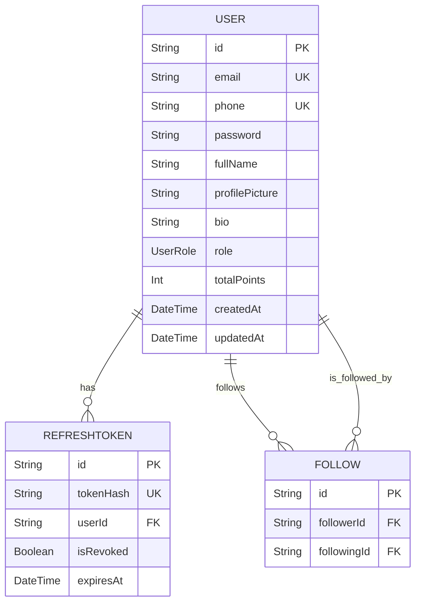

# User Authentication and Profile ERD

This document provides the Entity-Relationship Diagram for the user authentication and profile management system.

## Database Schema for User Management



## Detailed Table Specifications

### Core User & Authentication Tables

#### USERS
This is the primary table for storing user account and profile information.

```sql
CREATE TABLE "User" (
    "id" TEXT NOT NULL PRIMARY KEY,
    "email" TEXT NOT NULL,
    "phone" TEXT,
    "password" TEXT NOT NULL,
    "fullName" TEXT NOT NULL,
    "profilePicture" TEXT,
    "bio" TEXT,
    "city" TEXT,
    "interests" TEXT[],
    "instagramHandle" TEXT,
    "linkedinHandle" TEXT,
    "referralCode" TEXT NOT NULL,
    "role" "UserRole" NOT NULL DEFAULT 'GENERAL_USER',
    "isHostCertified" BOOLEAN NOT NULL DEFAULT false,
    "totalPoints" INTEGER NOT NULL DEFAULT 0,
    "createdAt" TIMESTAMP(3) NOT NULL DEFAULT CURRENT_TIMESTAMP,
    "updatedAt" TIMESTAMP(3) NOT NULL
);

CREATE UNIQUE INDEX "User_email_key" ON "User"("email");
CREATE UNIQUE INDEX "User_phone_key" ON "User"("phone");
CREATE UNIQUE INDEX "User_referralCode_key" ON "User"("referralCode");
```

#### REFRESHTOKENS
This table stores refresh tokens for persistent user sessions.

```sql
CREATE TABLE "RefreshToken" (
    "id" TEXT NOT NULL PRIMARY KEY,
    "tokenHash" TEXT NOT NULL,
    "tokenFamily" TEXT NOT NULL,
    "userId" TEXT NOT NULL,
    "isRevoked" BOOLEAN NOT NULL DEFAULT false,
    "expiresAt" TIMESTAMP(3) NOT NULL,
    "createdAt" TIMESTAMP(3) NOT NULL DEFAULT CURRENT_TIMESTAMP,
    CONSTRAINT "RefreshToken_userId_fkey" FOREIGN KEY ("userId") REFERENCES "User"("id") ON DELETE CASCADE ON UPDATE CASCADE
);

CREATE UNIQUE INDEX "RefreshToken_tokenHash_key" ON "RefreshToken"("tokenHash");
```

### Social & Interaction Tables

#### FOLLOWS
This table represents the social graph, storing follow relationships between users.

```sql
CREATE TABLE "Follow" (
    "id" TEXT NOT NULL PRIMARY KEY,
    "createdAt" TIMESTAMP(3) NOT NULL DEFAULT CURRENT_TIMESTAMP,
    "followerId" TEXT NOT NULL,
    "followingId" TEXT NOT NULL,
    CONSTRAINT "Follow_followerId_fkey" FOREIGN KEY ("followerId") REFERENCES "User"("id") ON DELETE RESTRICT ON UPDATE CASCADE,
    CONSTRAINT "Follow_followingId_fkey" FOREIGN KEY ("followingId") REFERENCES "User"("id") ON DELETE RESTRICT ON UPDATE CASCADE
);

CREATE UNIQUE INDEX "Follow_followerId_followingId_key" ON "Follow"("followerId", "followingId");
```

## Key Relationships & Constraints

### Business Rules

1.  **Uniqueness:** `email`, `phone`, and `referralCode` must be unique for each user.
2.  **Self-Follow:** Application logic should prevent users from following themselves.
3.  **Cascade Delete:** When a `User` is deleted, all their associated `RefreshToken`s are automatically deleted.

## Indexes for Performance

-   **Primary Lookups:** The `email` and `phone` columns on the `User` table are indexed for fast authentication lookups.
-   **Foreign Keys:** Indexes are automatically created for foreign key relationships, speeding up joins between tables (e.g., fetching a user's refresh tokens).
-   **Composite Indexes:** The `(followerId, followingId)` index on the `Follow` table ensures quick checks for existing follow relationships.

## Query Examples

### Get User for Authentication
```sql
SELECT * FROM "User" WHERE "email" = 'user@example.com' LIMIT 1;
```

### Get User's Followers
```sql
SELECT u.* FROM "User" u
JOIN "Follow" f ON u."id" = f."followerId"
WHERE f."followingId" = 'user-id-to-check';
```
