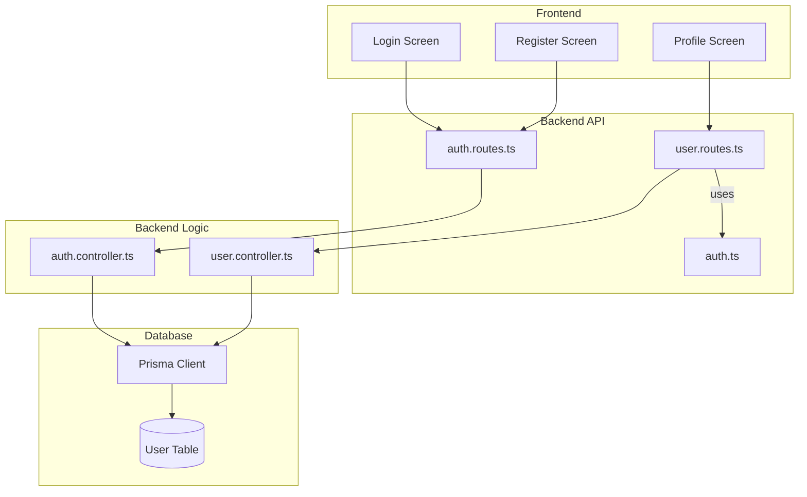
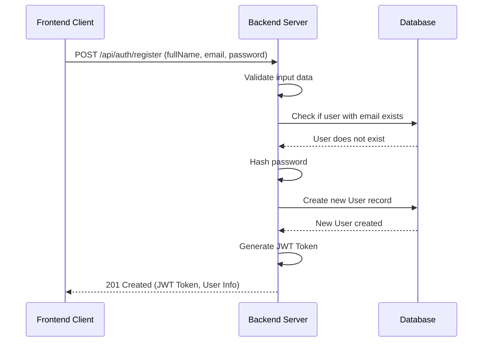
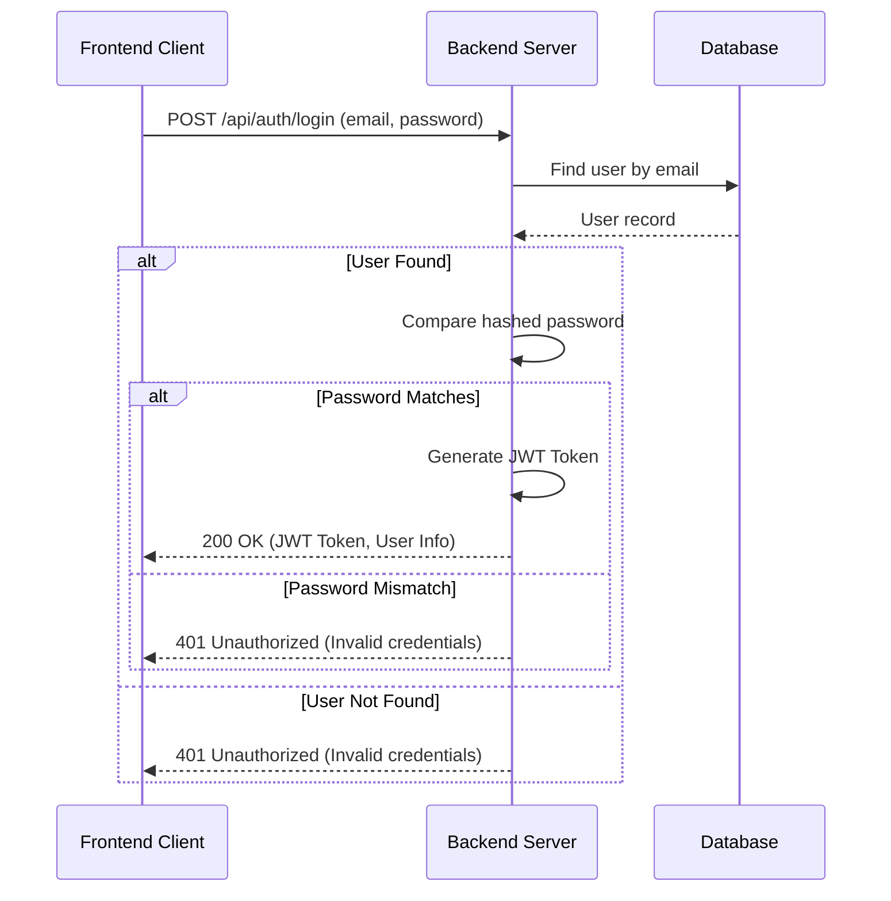
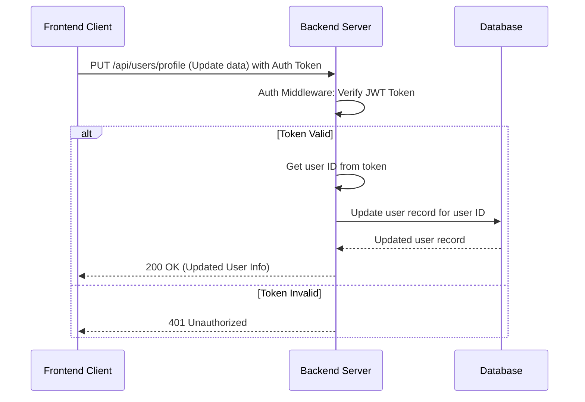

# User Auth & Profile UML Diagrams

## 1. Component Diagram - System Architecture

This diagram shows the high-level components involved in the user authentication and profile management system.

## 2. Sequence Diagram - User Registration

This diagram illustrates the sequence of events when a new user registers.

## 3. Sequence Diagram - User Login

This diagram illustrates the sequence of events when a user logs in.

## 4. Sequence Diagram - User Profile Update

This diagram illustrates the sequence of events when a user updates their profile.

