# Offerings - UML Diagrams

## Overview
This document contains UML diagrams for the Offerings feature, modeling the service marketplace system that allows users to offer and book six types of services: Local Guide, Homestay, Marketplace, Open to Connect, BerseBuddy, and BerseMentor.

## 1. Class Diagram

### Core Domain Classes

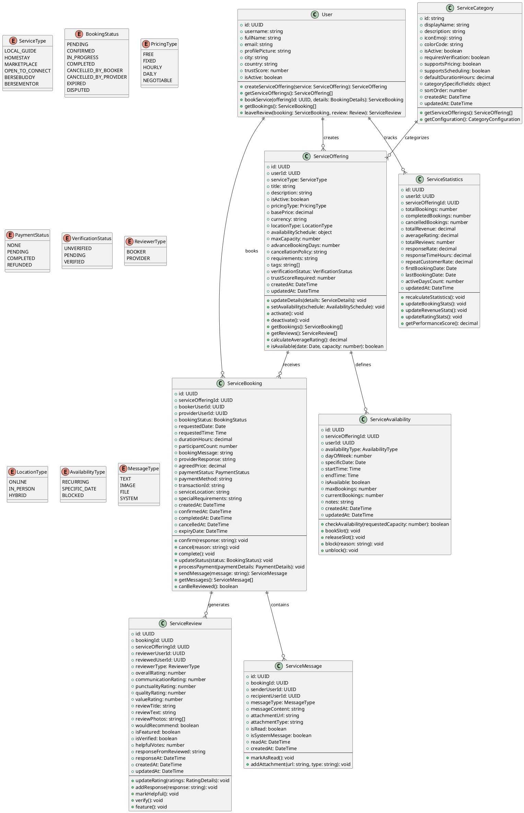

### Service Layer Classes

```plantuml
@startuml Offerings Service Classes

interface OfferingsService {
  +createServiceOffering(userId: UUID, offeringData: ServiceOfferingInput): ServiceOffering
  +updateServiceOffering(offeringId: UUID, updates: ServiceOfferingUpdate): ServiceOffering
  +deactivateServiceOffering(offeringId: UUID): void
  +getServiceOffering(offeringId: UUID): ServiceOffering
  +getUserServiceOfferings(userId: UUID): ServiceOffering[]
  +searchServices(criteria: SearchCriteria): ServiceOffering[]
  +getServicesByCategory(categoryId: string): ServiceOffering[]
  +getServicesByLocation(location: LocationFilter): ServiceOffering[]
}

interface BookingService {
  +createBooking(bookerUserId: UUID, offeringId: UUID, bookingData: BookingInput): ServiceBooking
  +confirmBooking(bookingId: UUID, response: string): ServiceBooking
  +cancelBooking(bookingId: UUID, reason: string): ServiceBooking
  +completeBooking(bookingId: UUID): ServiceBooking
  +getUserBookings(userId: UUID, type: BookingType): ServiceBooking[]
  +getBookingDetails(bookingId: UUID): BookingDetails
  +processPayment(bookingId: UUID, paymentData: PaymentInput): PaymentResult
}

interface ReviewService {
  +createReview(bookingId: UUID, reviewData: ReviewInput): ServiceReview
  +updateReview(reviewId: UUID, updates: ReviewUpdate): ServiceReview
  +respondToReview(reviewId: UUID, response: string): ServiceReview
  +getServiceReviews(offeringId: UUID): ServiceReview[]
  +getUserReviews(userId: UUID): ServiceReview[]
  +markReviewHelpful(reviewId: UUID, userId: UUID): void
  +reportReview(reviewId: UUID, reason: string): void
}

class OfferingsServiceImpl {
  -offeringsRepository: ServiceOfferingsRepository
  -userRepository: UserRepository
  -categoryRepository: ServiceCategoryRepository
  -availabilityService: AvailabilityService
  -statisticsService: StatisticsService
  -notificationService: NotificationService
  -trustChainService: TrustChainService
  --
  +createServiceOffering(userId: UUID, offeringData: ServiceOfferingInput): ServiceOffering
  +updateServiceOffering(offeringId: UUID, updates: ServiceOfferingUpdate): ServiceOffering
  +deactivateServiceOffering(offeringId: UUID): void
  +getServiceOffering(offeringId: UUID): ServiceOffering
  +getUserServiceOfferings(userId: UUID): ServiceOffering[]
  +searchServices(criteria: SearchCriteria): ServiceOffering[]
  +getServicesByCategory(categoryId: string): ServiceOffering[]
  +getServicesByLocation(location: LocationFilter): ServiceOffering[]
  --
  -validateServiceOffering(offering: ServiceOffering): void
  -checkUserEligibility(userId: UUID, serviceType: ServiceType): boolean
  -updateSearchIndex(offering: ServiceOffering): void
}

class BookingServiceImpl {
  -bookingRepository: ServiceBookingRepository
  -offeringsService: OfferingsService
  -availabilityService: AvailabilityService
  -paymentService: PaymentService
  -messagingService: MessagingService
  -notificationService: NotificationService
  --
  +createBooking(bookerUserId: UUID, offeringId: UUID, bookingData: BookingInput): ServiceBooking
  +confirmBooking(bookingId: UUID, response: string): ServiceBooking
  +cancelBooking(bookingId: UUID, reason: string): ServiceBooking
  +completeBooking(bookingId: UUID): ServiceBooking
  +getUserBookings(userId: UUID, type: BookingType): ServiceBooking[]
  +getBookingDetails(bookingId: UUID): BookingDetails
  +processPayment(bookingId: UUID, paymentData: PaymentInput): PaymentResult
  --
  -validateBookingRequest(booking: ServiceBooking): void
  -checkAvailability(offeringId: UUID, date: Date, capacity: number): boolean
  -sendBookingNotifications(booking: ServiceBooking, event: BookingEvent): void
}

class AvailabilityService {
  -availabilityRepository: ServiceAvailabilityRepository
  --
  +setAvailability(offeringId: UUID, availability: AvailabilityInput[]): void
  +getAvailability(offeringId: UUID, dateRange: DateRange): ServiceAvailability[]
  +checkSlotAvailability(offeringId: UUID, date: Date, time: Time, capacity: number): boolean
  +blockAvailability(offeringId: UUID, dateTime: DateTime, duration: Duration): void
  +updateBookingCount(availabilityId: UUID, increment: number): void
}

class StatisticsService {
  -statisticsRepository: ServiceStatisticsRepository
  --
  +calculateServiceStatistics(offeringId: UUID): ServiceStatistics
  +updateUserStatistics(userId: UUID): void
  +getProviderDashboard(userId: UUID): ProviderDashboard
  +getMarketplaceAnalytics(): MarketplaceAnalytics
  +getServicePerformanceMetrics(offeringId: UUID): PerformanceMetrics
}

OfferingsService <|-- OfferingsServiceImpl
BookingService <|-- BookingServiceImpl
OfferingsServiceImpl --> AvailabilityService
OfferingsServiceImpl --> StatisticsService
BookingServiceImpl --> AvailabilityService
BookingServiceImpl --> StatisticsService

@enduml
```

## 2. Sequence Diagrams

### 2.1 Create Service Offering Sequence

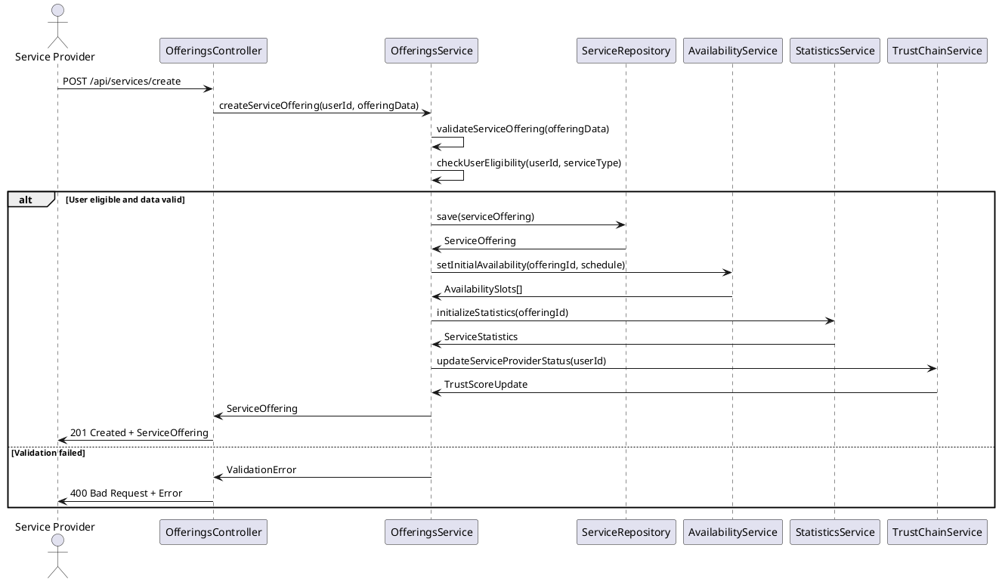

### 2.2 Service Booking Process Sequence

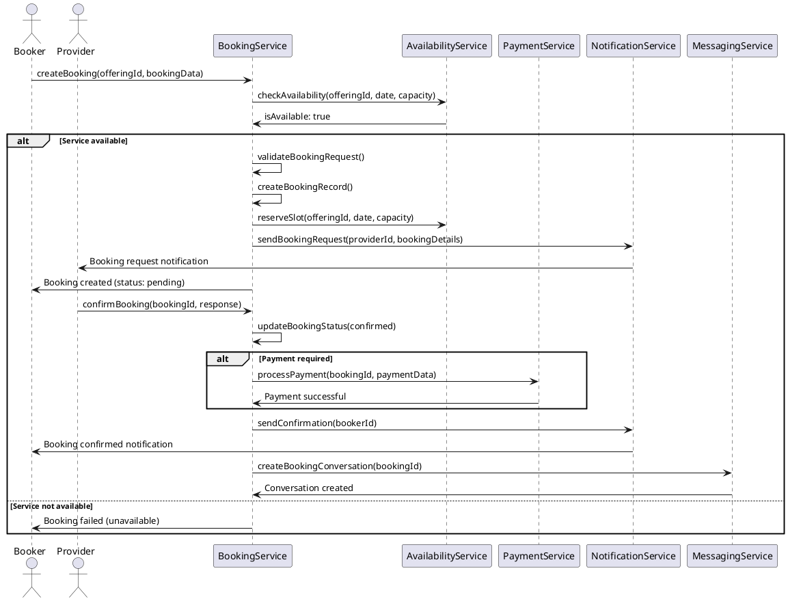

### 2.3 Service Review Process Sequence

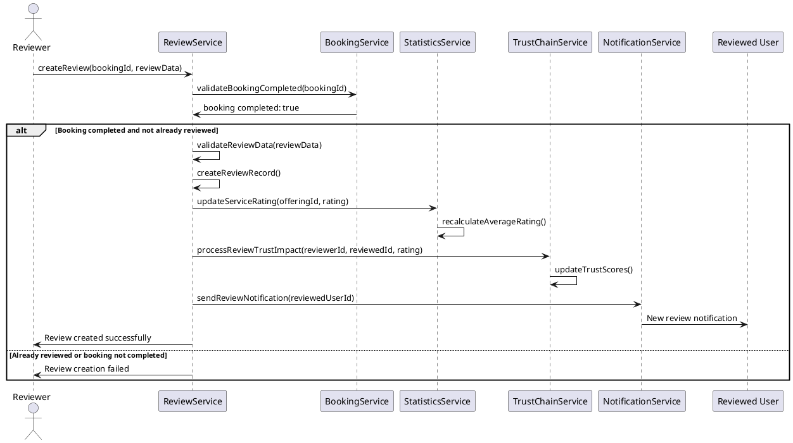

## 3. Use Case Diagram

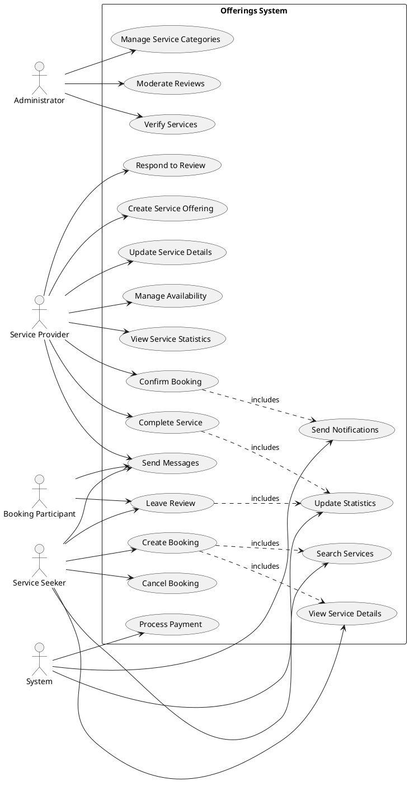

## 4. Activity Diagram

### 4.1 Service Booking Flow

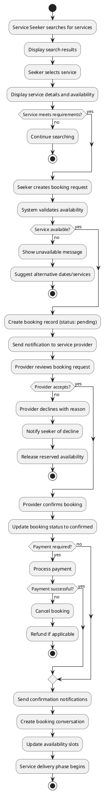

### 4.2 Service Review Process

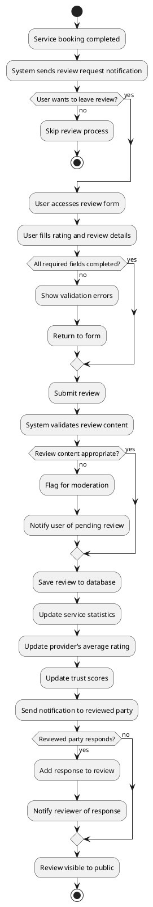

## 5. State Diagram

### 5.1 Service Offering State Diagram

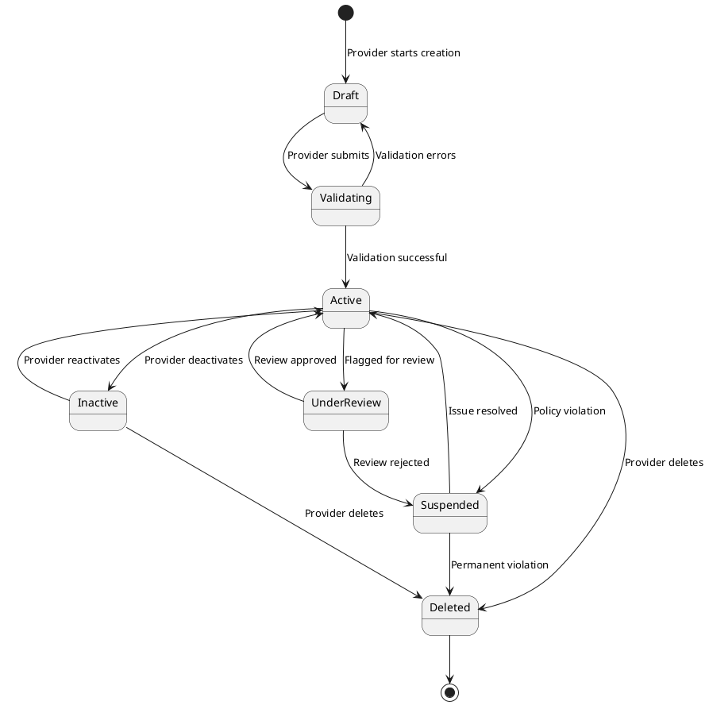

### 5.2 Service Booking State Diagram

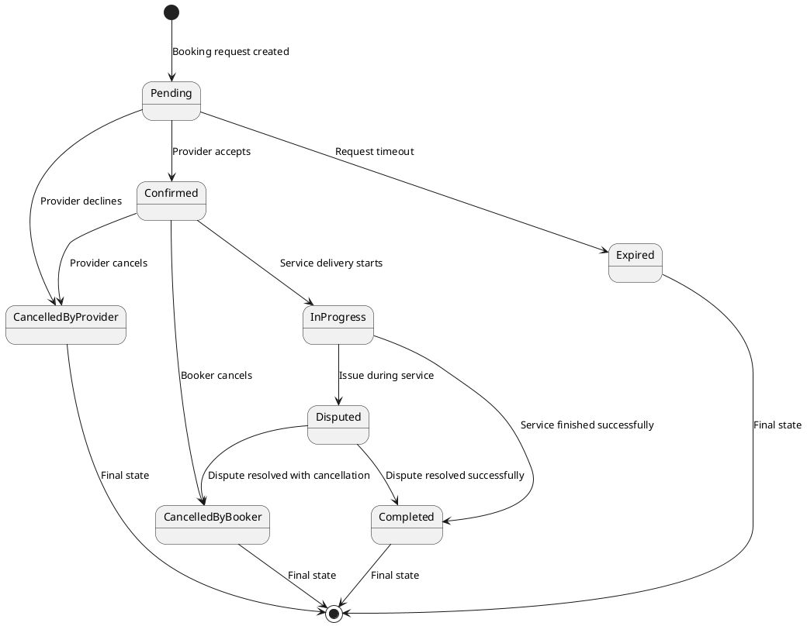

## 6. Component Diagram

```plantuml
@startuml Offerings Component Diagram

package "Frontend" {
  component "ServiceMarketplace" as Marketplace
  component "ServiceCreator" as Creator
  component "BookingManager" as BookingManager
  component "ReviewSystem" as ReviewSystem
  component "ProviderDashboard" as Dashboard
}

package "API Gateway" {
  component "OfferingsAPI" as API
  component "BookingAPI" as BookingAPI
  component "ReviewAPI" as ReviewAPI
}

package "Core Services" {
  component "OfferingsService" as OfferingsService
  component "BookingService" as BookingService
  component "ReviewService" as ReviewService
  component "AvailabilityService" as AvailabilityService
  component "StatisticsService" as StatisticsService
}

package "Repository Layer" {
  component "ServiceOfferingsRepo" as OfferingsRepo
  component "ServiceBookingsRepo" as BookingsRepo
  component "ServiceReviewsRepo" as ReviewsRepo
  component "ServiceAvailabilityRepo" as AvailabilityRepo
  component "ServiceStatisticsRepo" as StatsRepo
}

package "Database" {
  database "PostgreSQL" as DB
  database "Redis Cache" as Cache
  database "Elasticsearch" as Search
}

package "External Services" {
  component "PaymentService" as PaymentService
  component "NotificationService" as NotificationService
  component "TrustChainService" as TrustChain
  component "MessagingService" as MessagingService
}

' Frontend connections
Marketplace --> API
Creator --> API
BookingManager --> BookingAPI
ReviewSystem --> ReviewAPI
Dashboard --> API

' API connections
API --> OfferingsService
BookingAPI --> BookingService
ReviewAPI --> ReviewService

' Service connections
OfferingsService --> OfferingsRepo
OfferingsService --> AvailabilityService
OfferingsService --> StatisticsService
BookingService --> BookingsRepo
BookingService --> AvailabilityService
ReviewService --> ReviewsRepo
ReviewService --> StatisticsService

' Repository connections
OfferingsRepo --> DB
BookingsRepo --> DB
ReviewsRepo --> DB
AvailabilityRepo --> DB
StatsRepo --> DB

' Cache and search
OfferingsService --> Cache
OfferingsService --> Search
StatisticsService --> Cache

' External service connections
BookingService --> PaymentService
BookingService --> NotificationService
BookingService --> MessagingService
OfferingsService --> TrustChain
ReviewService --> TrustChain

@enduml
```

## 7. Deployment Diagram

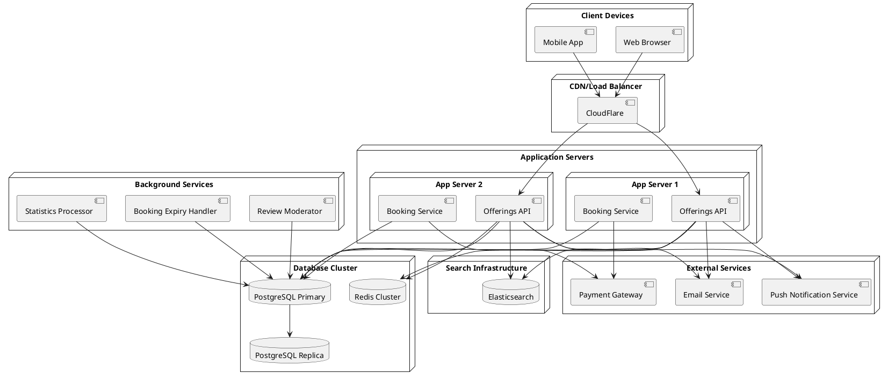

## Summary

These UML diagrams provide a comprehensive architectural view of the Offerings system:

1. **Class Diagram**: Shows the core domain models and business logic for the six service types
2. **Sequence Diagrams**: Illustrate the flow of service creation, booking, and review processes
3. **Use Case Diagram**: Maps out different user roles and their interactions with the system
4. **Activity Diagrams**: Detail the step-by-step processes for key workflows
5. **State Diagrams**: Show the lifecycle of service offerings and bookings
6. **Component Diagram**: Depicts the system's architectural layers and dependencies
7. **Deployment Diagram**: Shows how components are distributed across infrastructure

These diagrams serve as technical documentation for developers working on the Offerings feature, ensuring clear understanding of the complex service marketplace architecture and its integration with the broader Berse trust ecosystem.