# Travel Logbook - UML Diagrams

## Overview
This document contains UML diagrams for the Travel Logbook feature, including class diagrams, sequence diagrams, use case diagrams, and activity diagrams that model the system architecture and user interactions.

## 1. Class Diagram

### Core Domain Classes

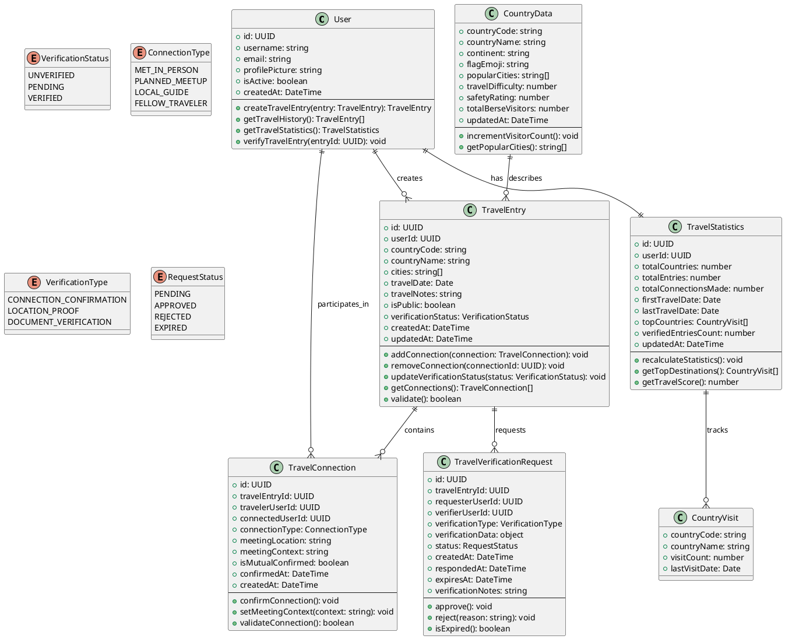

### Service Layer Classes

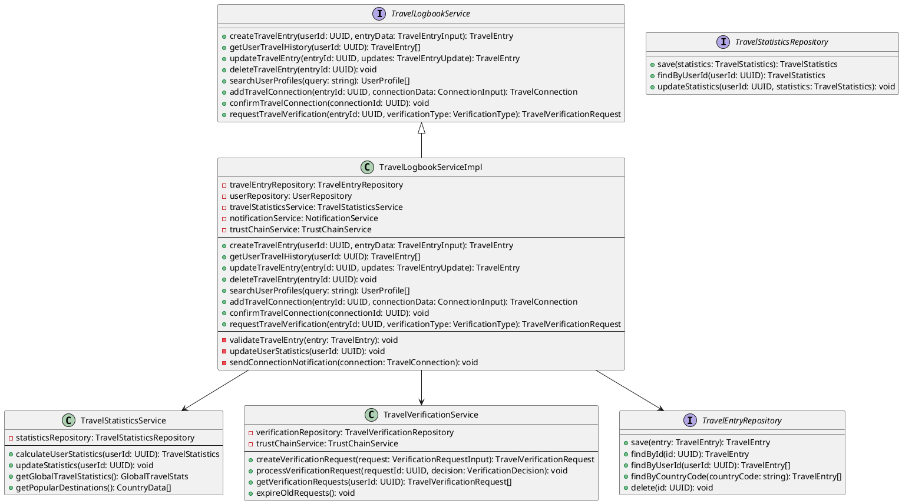

## 2. Sequence Diagrams

### 2.1 Create Travel Entry Sequence

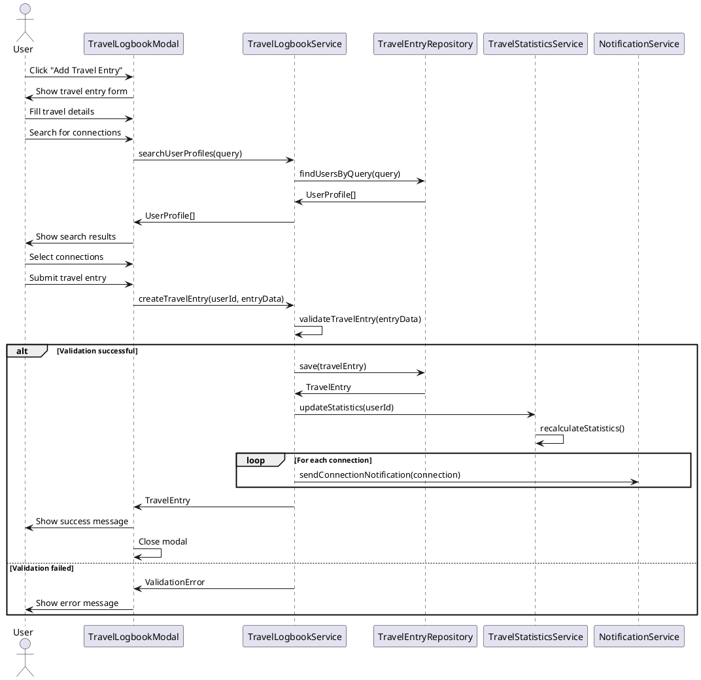

### 2.2 Travel Connection Confirmation Sequence

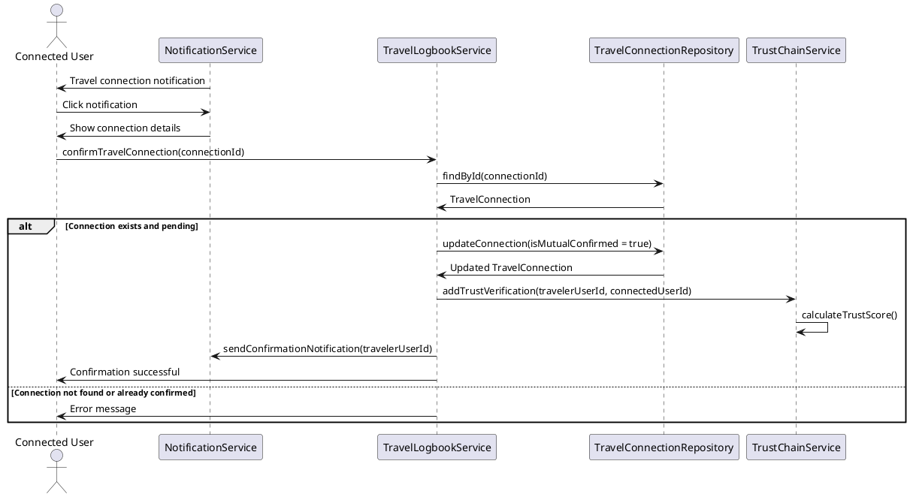

### 2.3 Travel Entry Verification Sequence

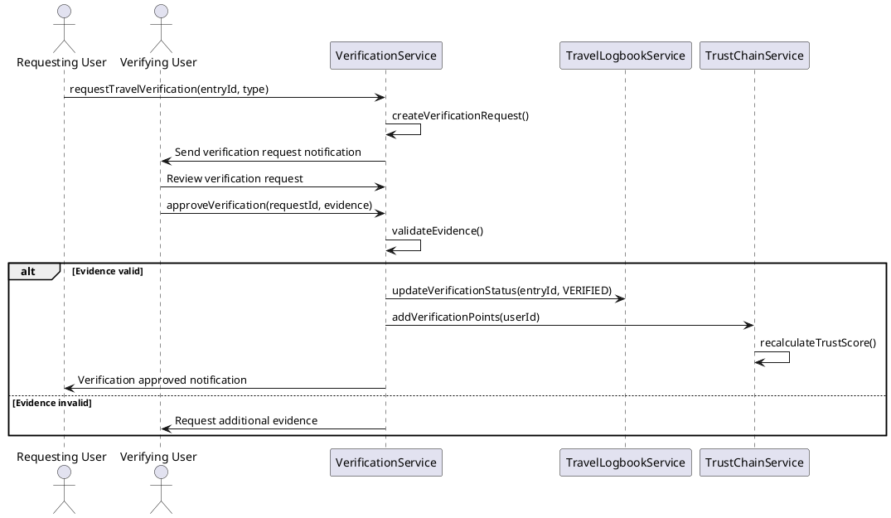

## 3. Use Case Diagram

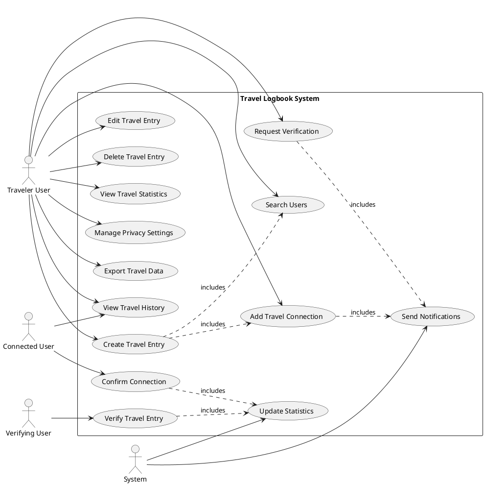

## 4. Activity Diagram

### 4.1 Create Travel Entry Activity

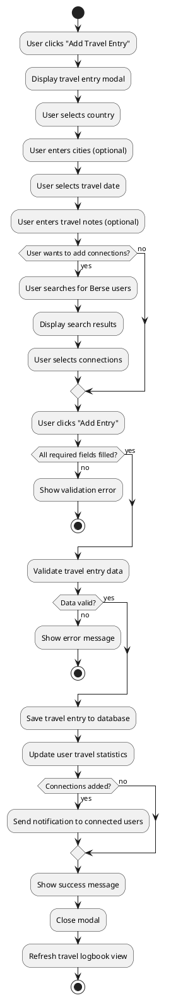

### 4.2 Travel Connection Confirmation Activity

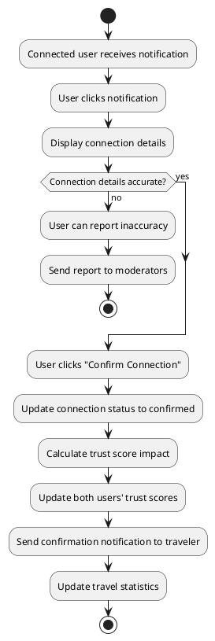

## 5. State Diagram

### 5.1 Travel Entry State Diagram

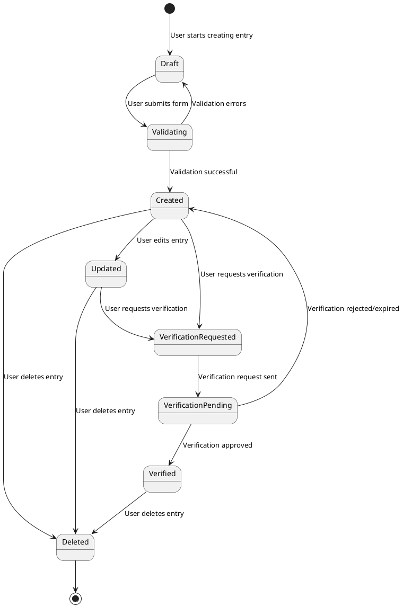

### 5.2 Travel Connection State Diagram

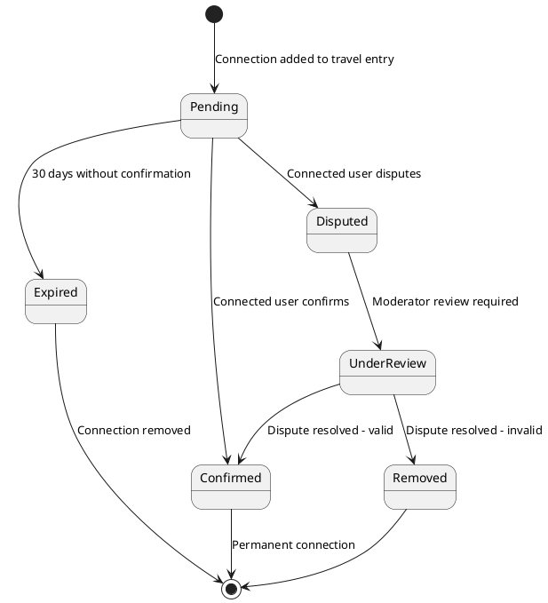

## 6. Component Diagram

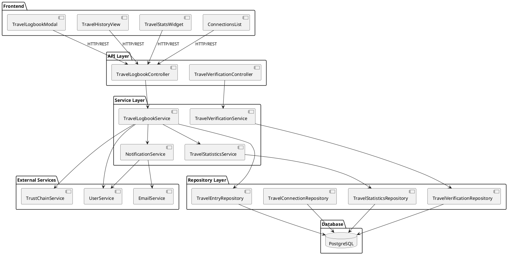

## 7. Deployment Diagram

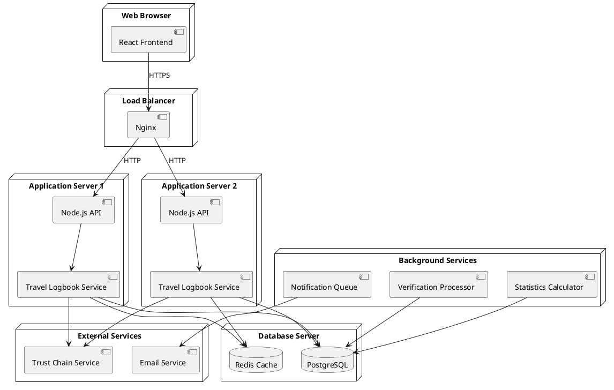

## Summary

These UML diagrams provide a comprehensive view of the Travel Logbook system architecture:

1. **Class Diagram**: Shows the core domain models and their relationships
2. **Sequence Diagrams**: Illustrate the flow of key user interactions
3. **Use Case Diagram**: Maps out user roles and system functionality
4. **Activity Diagrams**: Detail the step-by-step processes for key workflows
5. **State Diagrams**: Show the lifecycle of travel entries and connections
6. **Component Diagram**: Depicts the system's architectural components
7. **Deployment Diagram**: Shows how components are distributed across infrastructure

These diagrams serve as technical documentation for developers and architects working on the Travel Logbook feature, ensuring a clear understanding of system design, user flows, and component interactions.