# Trust Chain Entity Relationship Diagram (ERD)

## Complete Database Schema for Trust Chain System

```mermaid
erDiagram
    USERS ||--o{ TRUST_CHAINS : "vouches_for"
    USERS ||--o{ TRUST_CHAINS : "vouched_by"
    USERS ||--o{ VOUCH_REQUESTS : "sends"
    USERS ||--o{ VOUCH_REQUESTS : "receives"
    USERS ||--o{ TRUST_MOMENTS : "gives"
    USERS ||--o{ TRUST_MOMENTS : "receives"
    USERS ||--o{ USER_COMMUNITIES : "joins"
    USERS ||--o{ EVENT_ATTENDEES : "attends"
    USERS ||--|| TRUST_SCORES : "has"
    USERS ||--|| USER_PROFILES : "has"
    USERS ||--o{ USER_ACTIVITIES : "performs"
    USERS ||--o{ ACCOUNTABILITY_LOGS : "affects"
    USERS ||--o{ ACCOUNTABILITY_LOGS : "affected_by"
    
    COMMUNITIES ||--o{ USER_COMMUNITIES : "has_members"
    COMMUNITIES ||--o{ COMMUNITY_VOUCHES : "provides"
    COMMUNITIES ||--|| COMMUNITY_ADMINS : "managed_by"
    
    EVENTS ||--o{ EVENT_ATTENDEES : "has_attendees"
    EVENTS ||--o{ TRUST_MOMENTS : "generates"
    EVENTS ||--|| EVENT_ORGANIZERS : "organized_by"
    
    TRUST_CHAINS ||--o{ ACCOUNTABILITY_LOGS : "creates"
    TRUST_LEVELS ||--o{ USERS : "defines_level"
    
    USERS {
        uuid user_id PK
        string email UK
        string phone_number UK
        string username UK
        string password_hash
        enum account_status
        datetime created_at
        datetime last_active
        boolean is_verified
        string verification_token
        integer failed_login_attempts
        datetime locked_until
    }
    
    USER_PROFILES {
        uuid profile_id PK
        uuid user_id FK
        string first_name
        string last_name
        string display_name
        text bio
        string profile_picture_url
        date date_of_birth
        string nationality
        string current_city
        string languages
        json interests
        json social_links
        datetime updated_at
    }
    
    TRUST_SCORES {
        uuid score_id PK
        uuid user_id FK
        decimal total_score
        decimal vouch_score
        decimal moment_score
        decimal activity_score
        decimal community_score
        integer vouch_count
        integer moment_count
        integer event_count
        enum trust_level
        datetime last_calculated
        json score_breakdown
        decimal trust_velocity
    }
    
    TRUST_CHAINS {
        uuid chain_id PK
        uuid voucher_id FK
        uuid vouchee_id FK
        enum vouch_type
        decimal weight
        string vouch_message
        boolean is_active
        datetime created_at
        datetime revoked_at
        string revoke_reason
        decimal accountability_impact
        boolean is_primary
    }
    
    VOUCH_REQUESTS {
        uuid request_id PK
        uuid requester_id FK
        uuid requestee_id FK
        text request_message
        enum status
        datetime requested_at
        datetime responded_at
        text response_message
        datetime expires_at
        boolean is_expired
    }
    
    TRUST_MOMENTS {
        uuid moment_id PK
        uuid giver_id FK
        uuid receiver_id FK
        uuid event_id FK
        integer rating
        text feedback
        enum moment_type
        json moment_tags
        boolean is_verified
        datetime created_at
        string photo_proof_url
        decimal impact_score
    }
    
    COMMUNITIES {
        uuid community_id PK
        string name UK
        enum community_type
        text description
        string logo_url
        decimal trust_weight
        boolean is_verified
        datetime established_date
        integer member_count
        json verification_requirements
        string website_url
        string location
    }
    
    USER_COMMUNITIES {
        uuid membership_id PK
        uuid user_id FK
        uuid community_id FK
        datetime joined_at
        enum membership_status
        string verification_document
        datetime verified_at
        uuid verified_by FK
        boolean is_vouching_community
        datetime left_at
    }
    
    COMMUNITY_VOUCHES {
        uuid vouch_id PK
        uuid community_id FK
        uuid user_id FK
        uuid admin_id FK
        decimal weight
        datetime vouched_at
        boolean is_active
        text vouch_notes
    }
    
    COMMUNITY_ADMINS {
        uuid admin_id PK
        uuid community_id FK
        uuid user_id FK
        enum admin_level
        datetime appointed_at
        datetime removed_at
        json permissions
    }
    
    EVENTS {
        uuid event_id PK
        string title
        text description
        enum event_type
        datetime event_date
        string location
        point geo_location
        integer max_attendees
        integer current_attendees
        uuid organizer_id FK
        decimal trust_points
        json event_tags
        string cover_image_url
        enum status
        datetime created_at
    }
    
    EVENT_ATTENDEES {
        uuid attendance_id PK
        uuid event_id FK
        uuid user_id FK
        enum attendance_status
        datetime registered_at
        datetime checked_in_at
        point check_in_location
        boolean attended
        decimal trust_earned
        json attendance_proof
    }
    
    EVENT_ORGANIZERS {
        uuid organizer_id PK
        uuid event_id FK
        uuid user_id FK
        enum role
        datetime assigned_at
    }
    
    USER_ACTIVITIES {
        uuid activity_id PK
        uuid user_id FK
        enum activity_type
        json activity_data
        decimal trust_impact
        datetime performed_at
        string ip_address
        string user_agent
    }
    
    ACCOUNTABILITY_LOGS {
        uuid log_id PK
        uuid voucher_id FK
        uuid vouchee_id FK
        uuid chain_id FK
        enum impact_type
        decimal impact_value
        text description
        datetime occurred_at
        boolean is_processed
    }
    
    TRUST_LEVELS {
        uuid level_id PK
        string level_name UK
        integer min_score
        integer max_score
        integer vouch_limit
        json unlocked_features
        string badge_url
        text description
    }
```



## Detailed Table Specifications

### Core User Tables

#### USERS
Primary table for user authentication and account management.
```sql
CREATE TABLE users (
    user_id UUID PRIMARY KEY DEFAULT gen_random_uuid(),
    email VARCHAR(255) UNIQUE NOT NULL,
    phone_number VARCHAR(20) UNIQUE NOT NULL,
    username VARCHAR(50) UNIQUE NOT NULL,
    password_hash VARCHAR(255) NOT NULL,
    account_status ENUM('unverified', 'pending', 'partial', 'verified', 'trusted', 'leader', 'suspended', 'banned') DEFAULT 'unverified',
    created_at TIMESTAMP DEFAULT CURRENT_TIMESTAMP,
    last_active TIMESTAMP,
    is_verified BOOLEAN DEFAULT FALSE,
    verification_token VARCHAR(255),
    failed_login_attempts INTEGER DEFAULT 0,
    locked_until TIMESTAMP,
    INDEX idx_email (email),
    INDEX idx_phone (phone_number),
    INDEX idx_username (username),
    INDEX idx_status (account_status)
);
```

#### USER_PROFILES
Extended user information and preferences.
```sql
CREATE TABLE user_profiles (
    profile_id UUID PRIMARY KEY DEFAULT gen_random_uuid(),
    user_id UUID NOT NULL REFERENCES users(user_id) ON DELETE CASCADE,
    first_name VARCHAR(100),
    last_name VARCHAR(100),
    display_name VARCHAR(150),
    bio TEXT,
    profile_picture_url VARCHAR(500),
    date_of_birth DATE,
    nationality VARCHAR(100),
    current_city VARCHAR(200),
    languages JSON,
    interests JSON,
    social_links JSON,
    updated_at TIMESTAMP DEFAULT CURRENT_TIMESTAMP ON UPDATE CURRENT_TIMESTAMP,
    UNIQUE KEY (user_id),
    INDEX idx_user_profile (user_id)
);
```

### Trust System Tables

#### TRUST_SCORES
Real-time trust score tracking and calculation.
```sql
CREATE TABLE trust_scores (
    score_id UUID PRIMARY KEY DEFAULT gen_random_uuid(),
    user_id UUID NOT NULL REFERENCES users(user_id) ON DELETE CASCADE,
    total_score DECIMAL(5,2) DEFAULT 0.00,
    vouch_score DECIMAL(5,2) DEFAULT 0.00,
    moment_score DECIMAL(5,2) DEFAULT 0.00,
    activity_score DECIMAL(5,2) DEFAULT 0.00,
    community_score DECIMAL(5,2) DEFAULT 0.00,
    vouch_count INTEGER DEFAULT 0,
    moment_count INTEGER DEFAULT 0,
    event_count INTEGER DEFAULT 0,
    trust_level ENUM('starter', 'trusted', 'scout', 'leader') DEFAULT 'starter',
    last_calculated TIMESTAMP DEFAULT CURRENT_TIMESTAMP,
    score_breakdown JSON,
    trust_velocity DECIMAL(5,2),
    UNIQUE KEY (user_id),
    INDEX idx_trust_level (trust_level),
    INDEX idx_total_score (total_score)
);
```

#### TRUST_CHAINS
Core vouching relationships with accountability.
```sql
CREATE TABLE trust_chains (
    chain_id UUID PRIMARY KEY DEFAULT gen_random_uuid(),
    voucher_id UUID NOT NULL REFERENCES users(user_id),
    vouchee_id UUID NOT NULL REFERENCES users(user_id),
    vouch_type ENUM('primary', 'secondary', 'community') NOT NULL,
    weight DECIMAL(3,2) NOT NULL,
    vouch_message TEXT,
    is_active BOOLEAN DEFAULT TRUE,
    created_at TIMESTAMP DEFAULT CURRENT_TIMESTAMP,
    revoked_at TIMESTAMP,
    revoke_reason TEXT,
    accountability_impact DECIMAL(5,2) DEFAULT 0.00,
    is_primary BOOLEAN DEFAULT FALSE,
    UNIQUE KEY unique_vouch (voucher_id, vouchee_id),
    INDEX idx_voucher (voucher_id),
    INDEX idx_vouchee (vouchee_id),
    INDEX idx_active (is_active),
    CHECK (voucher_id != vouchee_id)
);
```

#### TRUST_MOMENTS
Event-based trust feedback system.
```sql
CREATE TABLE trust_moments (
    moment_id UUID PRIMARY KEY DEFAULT gen_random_uuid(),
    giver_id UUID NOT NULL REFERENCES users(user_id),
    receiver_id UUID NOT NULL REFERENCES users(user_id),
    event_id UUID REFERENCES events(event_id),
    rating INTEGER NOT NULL CHECK (rating BETWEEN 1 AND 5),
    feedback TEXT,
    moment_type ENUM('event', 'hosting', 'mentoring', 'volunteering', 'other') NOT NULL,
    moment_tags JSON,
    is_verified BOOLEAN DEFAULT FALSE,
    created_at TIMESTAMP DEFAULT CURRENT_TIMESTAMP,
    photo_proof_url VARCHAR(500),
    impact_score DECIMAL(3,2),
    INDEX idx_giver (giver_id),
    INDEX idx_receiver (receiver_id),
    INDEX idx_event (event_id),
    INDEX idx_created (created_at),
    CHECK (giver_id != receiver_id)
);
```

### Community Tables

#### COMMUNITIES
Verified communities that can vouch for members.
```sql
CREATE TABLE communities (
    community_id UUID PRIMARY KEY DEFAULT gen_random_uuid(),
    name VARCHAR(255) UNIQUE NOT NULL,
    community_type ENUM('university', 'company', 'organization', 'club', 'other') NOT NULL,
    description TEXT,
    logo_url VARCHAR(500),
    trust_weight DECIMAL(3,2) DEFAULT 0.10,
    is_verified BOOLEAN DEFAULT FALSE,
    established_date DATE,
    member_count INTEGER DEFAULT 0,
    verification_requirements JSON,
    website_url VARCHAR(500),
    location VARCHAR(200),
    INDEX idx_name (name),
    INDEX idx_type (community_type),
    INDEX idx_verified (is_verified)
);
```

#### USER_COMMUNITIES
Many-to-many relationship between users and communities.
```sql
CREATE TABLE user_communities (
    membership_id UUID PRIMARY KEY DEFAULT gen_random_uuid(),
    user_id UUID NOT NULL REFERENCES users(user_id),
    community_id UUID NOT NULL REFERENCES communities(community_id),
    joined_at TIMESTAMP DEFAULT CURRENT_TIMESTAMP,
    membership_status ENUM('pending', 'active', 'inactive', 'removed') DEFAULT 'pending',
    verification_document VARCHAR(500),
    verified_at TIMESTAMP,
    verified_by UUID REFERENCES users(user_id),
    is_vouching_community BOOLEAN DEFAULT FALSE,
    left_at TIMESTAMP,
    UNIQUE KEY unique_membership (user_id, community_id),
    INDEX idx_user (user_id),
    INDEX idx_community (community_id),
    INDEX idx_status (membership_status)
);
```

### Event Tables

#### EVENTS
Physical events where trust is built.
```sql
CREATE TABLE events (
    event_id UUID PRIMARY KEY DEFAULT gen_random_uuid(),
    title VARCHAR(255) NOT NULL,
    description TEXT,
    event_type ENUM('social', 'professional', 'sports', 'volunteer', 'travel', 'other') NOT NULL,
    event_date TIMESTAMP NOT NULL,
    location VARCHAR(500),
    geo_location POINT,
    max_attendees INTEGER,
    current_attendees INTEGER DEFAULT 0,
    organizer_id UUID NOT NULL REFERENCES users(user_id),
    trust_points DECIMAL(3,1) DEFAULT 1.0,
    event_tags JSON,
    cover_image_url VARCHAR(500),
    status ENUM('draft', 'published', 'ongoing', 'completed', 'cancelled') DEFAULT 'draft',
    created_at TIMESTAMP DEFAULT CURRENT_TIMESTAMP,
    INDEX idx_date (event_date),
    INDEX idx_organizer (organizer_id),
    INDEX idx_status (status),
    SPATIAL INDEX idx_location (geo_location)
);
```

#### EVENT_ATTENDEES
Track event participation and check-ins.
```sql
CREATE TABLE event_attendees (
    attendance_id UUID PRIMARY KEY DEFAULT gen_random_uuid(),
    event_id UUID NOT NULL REFERENCES events(event_id),
    user_id UUID NOT NULL REFERENCES users(user_id),
    attendance_status ENUM('registered', 'waitlisted', 'checked_in', 'no_show', 'cancelled') DEFAULT 'registered',
    registered_at TIMESTAMP DEFAULT CURRENT_TIMESTAMP,
    checked_in_at TIMESTAMP,
    check_in_location POINT,
    attended BOOLEAN DEFAULT FALSE,
    trust_earned DECIMAL(3,1) DEFAULT 0.0,
    attendance_proof JSON,
    UNIQUE KEY unique_attendance (event_id, user_id),
    INDEX idx_event (event_id),
    INDEX idx_user (user_id),
    INDEX idx_status (attendance_status)
);
```

### Accountability & Audit Tables

#### ACCOUNTABILITY_LOGS
Track the ripple effects of user behavior on their vouchers.
```sql
CREATE TABLE accountability_logs (
    log_id UUID PRIMARY KEY DEFAULT gen_random_uuid(),
    voucher_id UUID NOT NULL REFERENCES users(user_id),
    vouchee_id UUID NOT NULL REFERENCES users(user_id),
    chain_id UUID NOT NULL REFERENCES trust_chains(chain_id),
    impact_type ENUM('positive', 'negative', 'neutral') NOT NULL,
    impact_value DECIMAL(5,2) NOT NULL,
    description TEXT,
    occurred_at TIMESTAMP DEFAULT CURRENT_TIMESTAMP,
    is_processed BOOLEAN DEFAULT FALSE,
    INDEX idx_voucher (voucher_id),
    INDEX idx_vouchee (vouchee_id),
    INDEX idx_chain (chain_id),
    INDEX idx_occurred (occurred_at)
);
```

#### USER_ACTIVITIES
Comprehensive activity logging for trust calculation.
```sql
CREATE TABLE user_activities (
    activity_id UUID PRIMARY KEY DEFAULT gen_random_uuid(),
    user_id UUID NOT NULL REFERENCES users(user_id),
    activity_type ENUM('login', 'event_attend', 'vouch_given', 'vouch_received', 'moment_given', 'moment_received', 'profile_update', 'community_join', 'violation_report') NOT NULL,
    activity_data JSON,
    trust_impact DECIMAL(3,2) DEFAULT 0.00,
    performed_at TIMESTAMP DEFAULT CURRENT_TIMESTAMP,
    ip_address VARCHAR(45),
    user_agent VARCHAR(500),
    INDEX idx_user (user_id),
    INDEX idx_type (activity_type),
    INDEX idx_performed (performed_at)
);
```

## Key Relationships & Constraints

### Business Rules Enforced by Database

1. **Vouch Limits**
   - Primary vouch: Maximum 1 per user (enforced by unique constraint + is_primary flag)
   - Secondary vouches: Maximum 3 per user (enforced by application logic with DB check)
   - Community vouches: Maximum 2 per user (enforced by is_vouching_community flag)

2. **Self-Reference Prevention**
   - Users cannot vouch for themselves (CHECK constraint)
   - Users cannot give trust moments to themselves (CHECK constraint)

3. **Unique Relationships**
   - One vouch per voucher-vouchee pair (UNIQUE constraint)
   - One membership per user-community pair (UNIQUE constraint)
   - One attendance record per user-event pair (UNIQUE constraint)

4. **Cascade Operations**
   - Deleting a user cascades to profiles and scores
   - Vouches remain for accountability history (soft delete)

## Indexes for Performance

### Primary Indexes
- User lookups: email, phone_number, username
- Trust queries: trust_level, total_score
- Event queries: event_date, status, organizer
- Activity tracking: user_id, performed_at

### Composite Indexes
```sql
CREATE INDEX idx_trust_chain_active ON trust_chains(vouchee_id, is_active);
CREATE INDEX idx_event_upcoming ON events(event_date, status) WHERE status = 'published';
CREATE INDEX idx_user_trust ON trust_scores(user_id, total_score, trust_level);
CREATE INDEX idx_moment_recent ON trust_moments(receiver_id, created_at);
```

### Spatial Indexes
- Event locations for proximity searches
- Check-in locations for verification

## Data Integrity Triggers

### Trust Score Recalculation Trigger
```sql
CREATE TRIGGER update_trust_score
AFTER INSERT ON trust_chains
FOR EACH ROW
BEGIN
    CALL recalculate_trust_score(NEW.vouchee_id);
END;
```

### Accountability Impact Trigger
```sql
CREATE TRIGGER apply_accountability
AFTER INSERT ON accountability_logs
FOR EACH ROW
BEGIN
    UPDATE trust_scores 
    SET total_score = total_score + NEW.impact_value
    WHERE user_id = NEW.voucher_id;
END;
```

### Community Member Count Trigger
```sql
CREATE TRIGGER update_member_count
AFTER UPDATE ON user_communities
FOR EACH ROW
BEGIN
    IF NEW.membership_status = 'active' AND OLD.membership_status != 'active' THEN
        UPDATE communities 
        SET member_count = member_count + 1 
        WHERE community_id = NEW.community_id;
    END IF;
END;
```

## Query Examples

### Get User's Complete Trust Profile
```sql
SELECT 
    u.username,
    ts.total_score,
    ts.trust_level,
    COUNT(DISTINCT tc_given.chain_id) as vouches_given,
    COUNT(DISTINCT tc_received.chain_id) as vouches_received,
    COUNT(DISTINCT tm_given.moment_id) as moments_given,
    COUNT(DISTINCT tm_received.moment_id) as moments_received,
    COUNT(DISTINCT ea.event_id) as events_attended
FROM users u
JOIN trust_scores ts ON u.user_id = ts.user_id
LEFT JOIN trust_chains tc_given ON u.user_id = tc_given.voucher_id AND tc_given.is_active = TRUE
LEFT JOIN trust_chains tc_received ON u.user_id = tc_received.vouchee_id AND tc_received.is_active = TRUE
LEFT JOIN trust_moments tm_given ON u.user_id = tm_given.giver_id
LEFT JOIN trust_moments tm_received ON u.user_id = tm_received.receiver_id
LEFT JOIN event_attendees ea ON u.user_id = ea.user_id AND ea.attended = TRUE
WHERE u.user_id = ?
GROUP BY u.user_id;
```

### Find Mutual Trust Connections
```sql
WITH mutual_connections AS (
    SELECT 
        tc1.vouchee_id as user_a,
        tc2.vouchee_id as user_b,
        tc1.voucher_id as mutual_voucher
    FROM trust_chains tc1
    JOIN trust_chains tc2 ON tc1.voucher_id = tc2.voucher_id
    WHERE tc1.vouchee_id = ? 
    AND tc2.vouchee_id = ?
    AND tc1.is_active = TRUE 
    AND tc2.is_active = TRUE
)
SELECT 
    u.username as mutual_connection,
    ts.trust_level,
    ts.total_score
FROM mutual_connections mc
JOIN users u ON mc.mutual_voucher = u.user_id
JOIN trust_scores ts ON u.user_id = ts.user_id;
```

---

## Summary

This ERD provides a complete database schema for the Berse Trust Chain system with:
- **14 primary tables** covering all aspects of trust management
- **Enforced constraints** for business rules
- **Optimized indexes** for performance
- **Audit trails** for accountability
- **Spatial support** for location-based features
- **JSON fields** for flexible data storage
- **Trigger examples** for automated processes

The schema supports all requirements including:
- Limited vouching (3 people + 2 communities)
- Unlimited trust moments
- Accountability tracking
- Event-based trust building
- Community verification
- Progressive trust levels