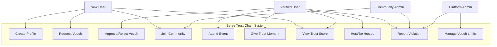
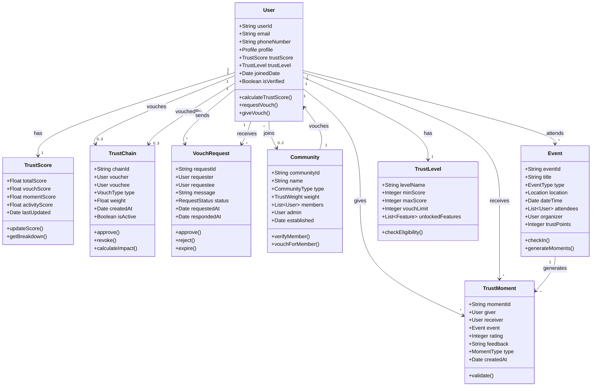
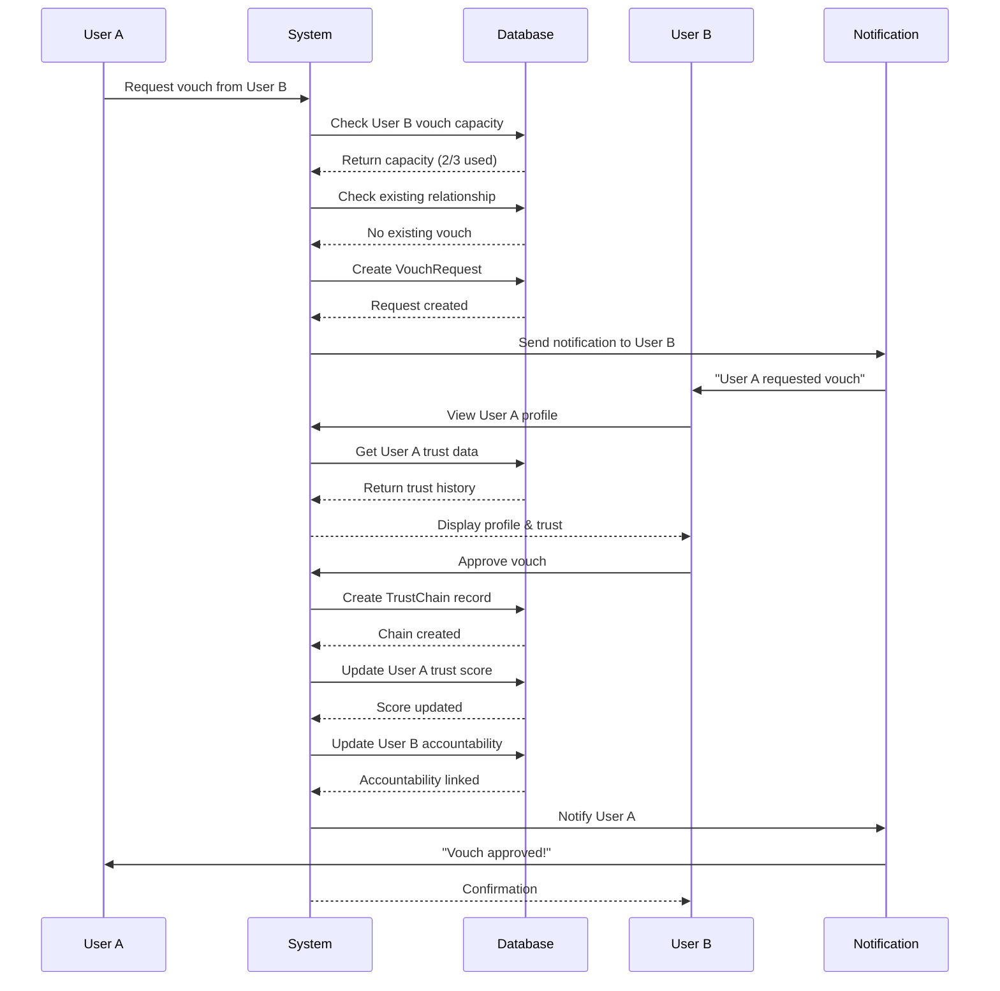
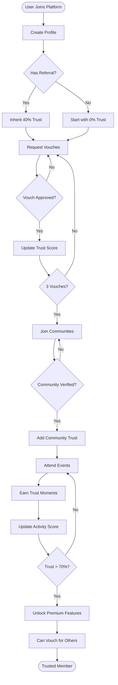
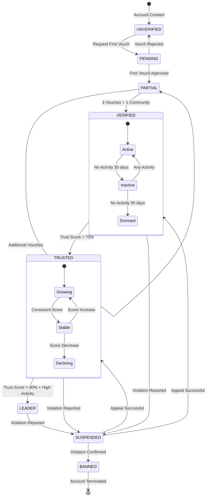
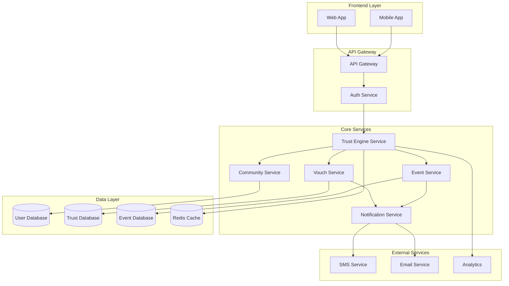
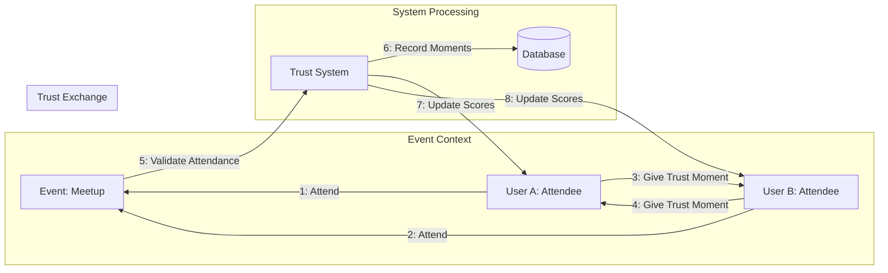
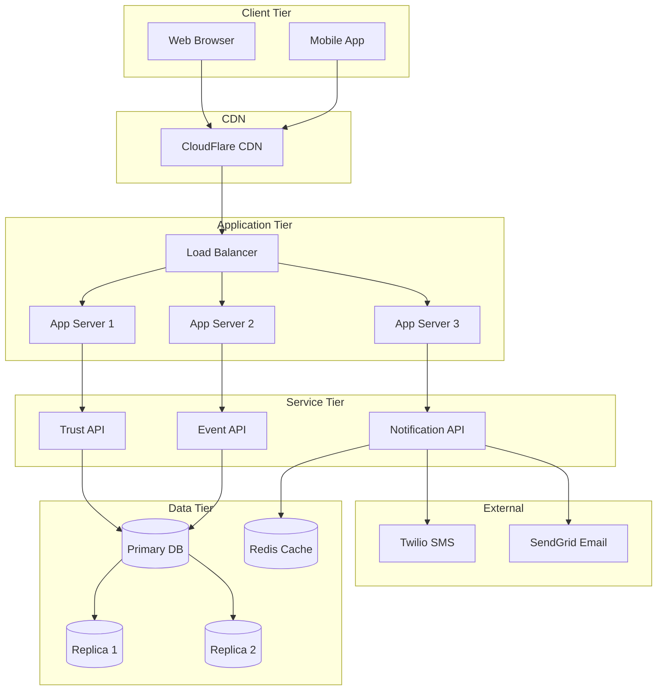
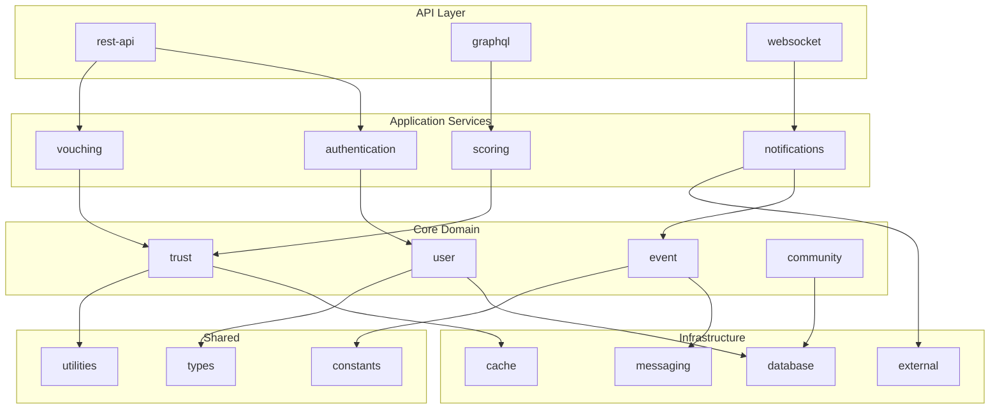
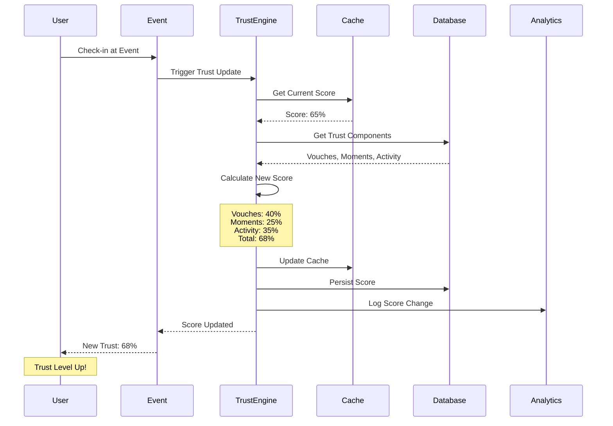

# Trust Chain UML Diagrams

## 1. Use Case Diagram - Trust Chain System

## 2. Class Diagram - Trust Chain Domain Model

## 3. Sequence Diagram - Vouch Request Flow

## 4. Activity Diagram - Trust Building Journey

## 5. State Machine Diagram - User Trust States

## 6. Component Diagram - System Architecture

## 7. Communication Diagram - Trust Moment Exchange

## 8. Deployment Diagram - Infrastructure

## 9. Package Diagram - Module Organization

## 10. Timing Diagram - Trust Score Update Lifecycle

---

## Summary

These UML diagrams comprehensively model the Berse Trust Chain system:

1. **Use Case Diagram**: Shows all actor interactions with the system
2. **Class Diagram**: Defines the domain model and relationships
3. **Sequence Diagram**: Details the vouch request flow
4. **Activity Diagram**: Maps the trust building journey
5. **State Machine**: Defines user trust state transitions
6. **Component Diagram**: Shows system architecture
7. **Communication Diagram**: Illustrates trust moment exchange
8. **Deployment Diagram**: Infrastructure layout
9. **Package Diagram**: Code organization structure
10. **Timing Diagram**: Trust score update lifecycle

Each diagram serves a specific purpose in documenting the Trust Chain mechanism, from user interactions to technical implementation details.