# Trust Chain Visual Flow Diagrams

## 1. Master Trust Chain Flow

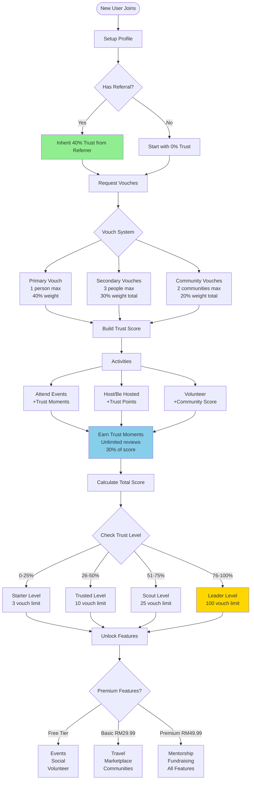

## 2. Vouch Request Detailed Flow

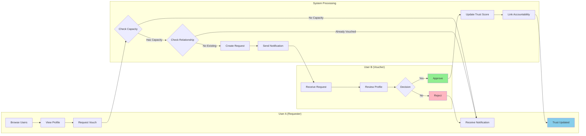

## 3. Trust Score Calculation Flow

```mermaid
flowchart TD
    subgraph "Input Sources"
        V[Vouches<br/>40%]
        M[Moments<br/>30%]
        A[Activities<br/>30%]
    end
    
    subgraph "Vouch Calculation"
        V --> V1[Primary Vouch<br/>1 × 40%]
        V --> V2[Secondary Vouches<br/>3 × 10% each]
        V --> V3[Community Vouches<br/>2 × 10% each]
        V1 --> VTotal[Vouch Total]
        V2 --> VTotal
        V3 --> VTotal
    end
    
    subgraph "Moment Calculation"
        M --> M1[Event Feedback]
        M --> M2[Host Reviews]
        M --> M3[Interaction Ratings]
        M1 --> MTotal[Moment Total<br/>Normalized 0-100]
        M2 --> MTotal
        M3 --> MTotal
    end
    
    subgraph "Activity Calculation"
        A --> A1[Events Attended]
        A --> A2[Events Organized]
        A --> A3[Volunteer Hours]
        A --> A4[Community Service]
        A1 --> ATotal[Activity Total<br/>Points System]
        A2 --> ATotal
        A3 --> ATotal
        A4 --> ATotal
    end
    
    VTotal --> Final[Final Score<br/>0-100%]
    MTotal --> Final
    ATotal --> Final
    
    Final --> Level{Determine Level}
    
    Level -->|0-25| L1[Starter]
    Level -->|26-50| L2[Trusted]
    Level -->|51-75| L3[Scout]
    Level -->|76-100| L4[Leader]
    
    style Final fill:#FFD700
    style V fill:#FF6B6B
    style M fill:#4ECDC4
    style A fill:#45B7D1
```

## 4. Accountability Chain Flow

```mermaid
flowchart TB
    subgraph "Trust Chain"
        UserA[User A<br/>Voucher]
        UserB[User B<br/>Vouchee]
        UserA -->|Vouches For| UserB
    end
    
    subgraph "User B Behavior"
        UserB --> Behavior{Behavior Type}
        Behavior -->|Positive| Good[Good Actions<br/>✓ Attend Events<br/>✓ Get Good Reviews<br/>✓ Help Others]
        Behavior -->|Negative| Bad[Bad Actions<br/>✗ Violations<br/>✗ No Shows<br/>✗ Bad Reviews]
    end
    
    subgraph "Impact on User A"
        Good --> PositiveImpact[User A Gets:<br/>+0.5% Trust Boost<br/>Reputation Increase]
        Bad --> NegativeImpact[User A Gets:<br/>-2% Trust Penalty<br/>Reputation Damage]
    end
    
    subgraph "Impact on User B"
        Good --> UserBGood[User B Gets:<br/>+1% Trust Moment<br/>Better Opportunities]
        Bad --> UserBBad[User B Gets:<br/>-5% Trust Penalty<br/>Possible Suspension]
    end
    
    PositiveImpact --> UpdateScores[Update Both Scores]
    NegativeImpact --> UpdateScores
    UserBGood --> UpdateScores
    UserBBad --> UpdateScores
    
    UpdateScores --> Cascade{Cascade Effect?}
    Cascade -->|Major Violation| SuspendChain[Suspend Entire Chain]
    Cascade -->|Minor Issue| Warning[Warning Issued]
    
    style Good fill:#90EE90
    style Bad fill:#FFB6C1
    style PositiveImpact fill:#98FB98
    style NegativeImpact fill:#FFA07A
```

## 5. Event Trust Building Flow

```mermaid
flowchart LR
    subgraph "Before Event"
        Browse[Browse Events] --> View[View Attendees]
        View --> Check[Check Mutual Trust]
        Check --> Register[Register for Event]
    end
    
    subgraph "During Event"
        Register --> Attend[Attend Event]
        Attend --> CheckIn[Check-in<br/>Location Verified]
        CheckIn --> Network[Network & Meet]
        Network --> Exchange[Exchange Contacts]
    end
    
    subgraph "After Event"
        Exchange --> GiveMoments[Give Trust Moments<br/>Within 7 days]
        GiveMoments --> ReceiveMoments[Receive Trust Moments]
        ReceiveMoments --> UpdateScore[Score Updated]
        UpdateScore --> BuildNetwork[Network Grows]
    end
    
    subgraph "Trust Rewards"
        BuildNetwork --> Rewards{Trust Level}
        Rewards -->|High| Premium[Premium Events]
        Rewards -->|Medium| Standard[Standard Events]
        Rewards -->|Low| Basic[Basic Events]
    end
    
    style CheckIn fill:#87CEEB
    style GiveMoments fill:#90EE90
    style UpdateScore fill:#FFD700
```

## 6. Community Verification Flow

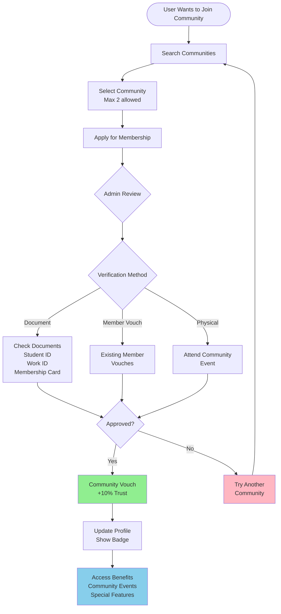

## 7. Trust Moment Generation Flow

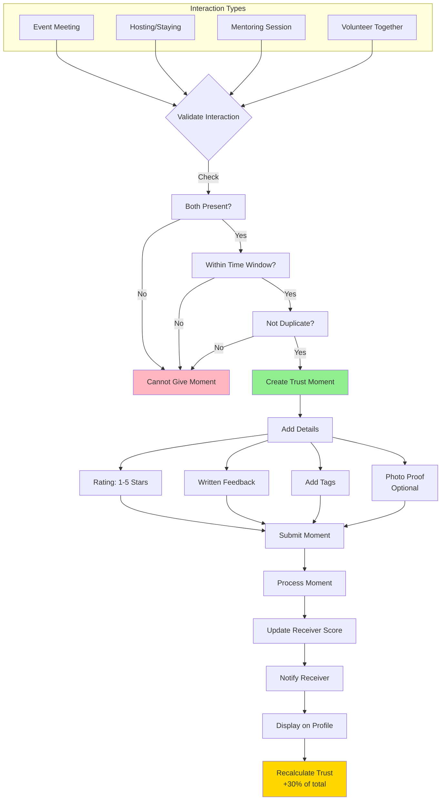

## 8. Progressive Trust Unlocking Flow

```mermaid
flowchart LR
    subgraph "Trust Progression"
        Start[0% Trust] --> T25[25% Trust]
        T25 --> T50[50% Trust]
        T50 --> T75[75% Trust]
        T75 --> T100[100% Trust]
    end
    
    subgraph "Features Unlocked"
        Start --> F1[✓ View Events<br/>✓ Basic Profile]
        T25 --> F2[✓ Join Events<br/>✓ Give Moments<br/>✓ Request Vouches]
        T50 --> F3[✓ Host/Be Hosted<br/>✓ Marketplace<br/>✓ Travel Features]
        T75 --> F4[✓ Organize Events<br/>✓ Vouch for Others<br/>✓ Mentorship]
        T100 --> F5[✓ Fundraising<br/>✓ Leadership<br/>✓ All Premium]
    end
    
    subgraph "Vouch Limits"
        Start --> V1[Can't Vouch]
        T25 --> V2[3 Vouches]
        T50 --> V3[10 Vouches]
        T75 --> V4[25 Vouches]
        T100 --> V5[100 Vouches]
    end
    
    style T100 fill:#FFD700
    style F5 fill:#90EE90
    style V5 fill:#87CEEB
```

## 9. Trust Violation & Recovery Flow

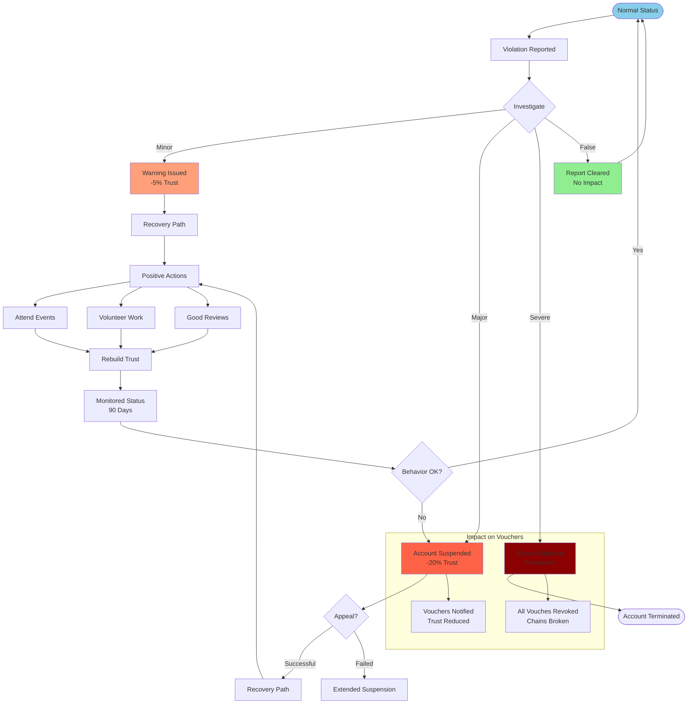

## 10. Complete User Lifecycle Flow

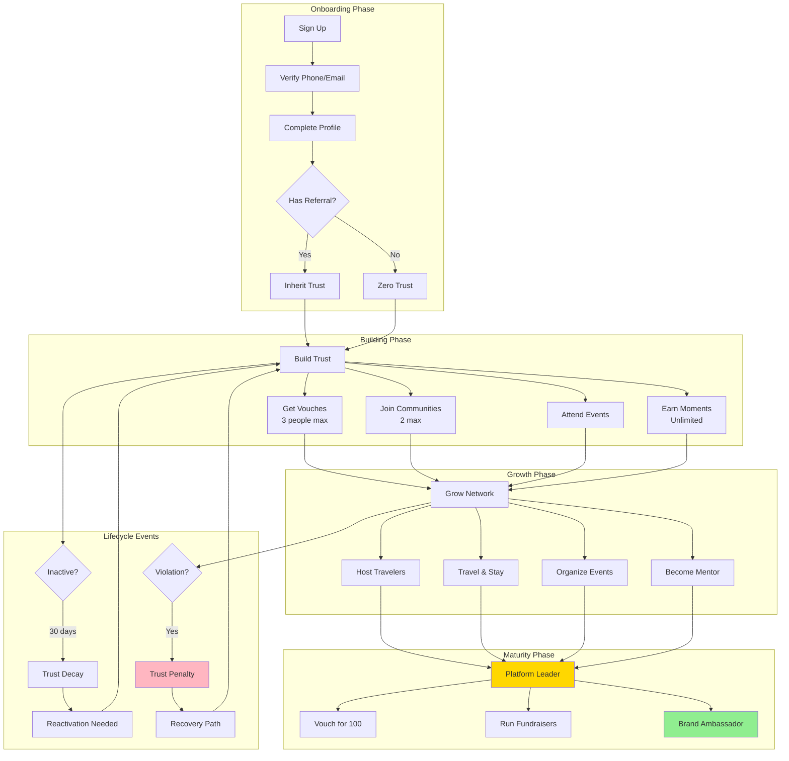

## Summary Dashboard View

```mermaid
flowchart TB
    subgraph "Trust Score Breakdown"
        Score[Total Score: 72%]
        Score --> Components
        Components --> C1[Vouches: 35/40%]
        Components --> C2[Moments: 22/30%]
        Components --> C3[Activity: 15/30%]
    end
    
    subgraph "Trust Chain Status"
        Chain[Active Chains: 4/6]
        Chain --> Primary[Primary: John ✓]
        Chain --> Secondary[Secondary: Amy, Ben, Clara]
        Chain --> Community[Communities: University, Tech Club]
    end
    
    subgraph "Recent Activity"
        Activity[Last 7 Days]
        Activity --> E1[Events: 3 attended]
        Activity --> M1[Moments: 8 received]
        Activity --> V1[Vouches: 1 new request]
    end
    
    subgraph "Trust Level"
        Level[Current: Scout]
        Level --> Progress[Progress: 72/75%]
        Progress --> Next[Next: Leader at 76%]
        Next --> Unlock[Unlocks: 50 vouch limit]
    end
    
    style Score fill:#87CEEB
    style Level fill:#FFD700
    style Chain fill:#90EE90
```

---

## Visual Flow Key Features

1. **Color Coding**:
   - 🟢 Green: Positive actions/approved
   - 🔵 Blue: Neutral/informational
   - 🟡 Yellow/Gold: Achievement/premium
   - 🔴 Red/Pink: Negative/rejected

2. **Flow Types**:
   - Linear flows for sequential processes
   - Decision trees for conditional logic
   - Circular flows for recurring processes
   - Hierarchical for level progression

3. **User Perspectives**:
   - New user journey
   - Verified user capabilities
   - Community admin functions
   - Platform growth stages

These visual flows provide a comprehensive understanding of how users interact with the Trust Chain system, from onboarding to becoming platform leaders, including all accountability mechanisms and trust-building activities.