# BerseMuka App - User Flow Diagram

## Overview
BerseMuka is a comprehensive social community platform with features for networking, events, mentorship, and community engagement.

## User Flow Diagram

```mermaid
graph TB
    Start([App Launch]) --> Splash[Splash Screen]
    Splash --> AuthCheck{User Authenticated?}
    
    %% Authentication Flow
    AuthCheck -->|No| Login[Login Screen]
    AuthCheck -->|Yes| Dashboard[Dashboard]
    Login --> LoginAction{Login Action}
    LoginAction -->|Success| Dashboard
    LoginAction -->|Register| Register[Register Screen]
    Register --> RegAction{Registration}
    RegAction -->|Success| Dashboard
    RegAction -->|Back| Login
    
    %% Main Dashboard Hub
    Dashboard --> MainFeatures{Main Features}
    
    %% Core Social Features
    MainFeatures --> Connect[BerseConnect<br/>Networking]
    MainFeatures --> Match[BerseMatch<br/>User Matching]
    MainFeatures --> Forum[Forum<br/>Community Discussions]
    MainFeatures --> Events[Events Hub]
    MainFeatures --> Rewards[Rewards & Points]
    MainFeatures --> Messages[Messages/Chat]
    
    %% Events System
    Events --> EventList[Browse Events]
    Events --> CreateEvent[Create Event]
    Events --> MyEvents[My Events]
    Events --> EventMgmt[Event Management]
    EventList --> EventDetails[Event Details]
    EventDetails --> BookMeetup[Book Meetup]
    EventDetails --> JoinEvent[Join Event]
    
    %% Activity Features
    MainFeatures --> Activities{Activities}
    Activities --> Mentor[BerseMentor<br/>Mentorship Program]
    Activities --> Buddy[BerseBuddy<br/>Buddy System]
    Activities --> Social[Social Events]
    Activities --> Cafe[Cafe Meetups]
    Activities --> Sports[Sukan Squad<br/>Sports Activities]
    Activities --> Volunteer[Volunteer<br/>Opportunities]
    Activities --> Trips[Trip Planning]
    Activities --> Communities[Communities]
    
    %% Gamification & Rewards
    Rewards --> Points[Points Details]
    Rewards --> Leaderboard[Leaderboard]
    Rewards --> Vouchers[Browse Vouchers]
    Rewards --> MyVouchers[My Vouchers]
    Rewards --> CardGame[BerseCard Game]
    Points --> RedeemRewards[Redeem Rewards]
    
    %% Profile & Settings
    Dashboard --> Profile[Profile]
    Profile --> EditProfile[Edit Profile]
    Profile --> Settings[Settings]
    Profile --> Notifications[Notifications]
    
    %% Forum Features
    Forum --> ViewPosts[View Posts]
    Forum --> CreatePost[Create Forum Post]
    ViewPosts --> PostInteraction[Like/Comment/Share]
    
    %% Special Features
    MainFeatures --> Special{Special Programs}
    Special --> BerseMukha[BerseMukha Event<br/>Special Events]
    Special --> IlmInit[Ilm Initiative<br/>Learning Programs]
    Special --> Donate[Donation Platform]
    
    %% Navigation Controls
    Dashboard -.->|Side Menu| SideMenu[Profile Sidebar<br/>Quick Actions]
    Dashboard -.->|Bottom Nav| NavBar[Main Navigation<br/>Home/Connect/Match/Forum/Profile]
    
    %% Logout Flow
    Settings --> Logout[Logout]
    Logout --> Login
    
    %% Deep Linking
    DeepLink[Deep Link<br/>join-event/:id] --> EventDeepLink[Event Deep Link Handler]
    EventDeepLink --> AuthCheck2{Authenticated?}
    AuthCheck2 -->|Yes| EventDetails
    AuthCheck2 -->|No| Login
    
    %% Styling
    classDef authNode fill:#FFE5B4,stroke:#D2691E,stroke-width:2px
    classDef mainNode fill:#E6F3FF,stroke:#4A90E2,stroke-width:2px
    classDef activityNode fill:#E8F5E9,stroke:#4CAF50,stroke-width:2px
    classDef rewardNode fill:#FFF3E0,stroke:#FF9800,stroke-width:2px
    classDef specialNode fill:#F3E5F5,stroke:#9C27B0,stroke-width:2px
    
    class Login,Register,Splash authNode
    class Dashboard,Connect,Match,Forum,Events mainNode
    class Mentor,Buddy,Social,Cafe,Sports,Volunteer,Trips,Communities activityNode
    class Rewards,Points,Leaderboard,Vouchers,MyVouchers,CardGame rewardNode
    class BerseMukha,IlmInit,Donate specialNode
```



## Key User Journeys

### 1. New User Onboarding
```
Splash Screen → Login → Register → Complete Profile → Dashboard → Explore Features
```

### 2. Event Participation
```
Dashboard → Events → Browse Events → Event Details → Register/Join → Add to Calendar → Attend Event → Earn Points
```

### 3. Social Networking
```
Dashboard → BerseConnect → Browse Profiles → Send Connection Request → Chat → Schedule Meetup
```

### 4. Matching & Mentorship
```
Dashboard → BerseMatch → Set Preferences → Get Matched → Connect with Match → Start Conversation
Dashboard → BerseMentor → Browse Mentors → Request Mentorship → Schedule Sessions
```

### 5. Community Engagement
```
Dashboard → Forum → Browse Topics → Create/Reply to Posts → Build Reputation → Earn Points
```

### 6. Rewards Journey
```
Participate in Activities → Earn Points → View Points Balance → Browse Vouchers → Redeem Rewards → Use Vouchers
```

## Navigation Structure

### Primary Navigation (Bottom Nav Bar)
- **Home** - Dashboard
- **Connect** - BerseConnect (Networking)
- **Match** - BerseMatch (User Matching)
- **Forum** - Community Forum
- **Profile** - User Profile

### Secondary Navigation (Side Menu/Profile Sidebar)
- Profile Management
- Settings
- My Events
- My Vouchers
- Messages
- Notifications
- Points & Rewards
- Logout

### Feature Categories

#### 🤝 Social & Networking
- BerseConnect - Professional networking
- BerseMatch - Smart user matching
- BerseBuddy - Buddy system
- Messages - Direct messaging

#### 📅 Events & Activities
- Event browsing and creation
- Event management
- Cafe meetups
- Social events
- Trips
- BerseMukha special events

#### 🎯 Programs & Initiatives
- BerseMentor - Mentorship program
- Ilm Initiative - Learning programs
- Volunteer opportunities
- Sukan Squad - Sports activities
- Communities

#### 🏆 Gamification
- Points system
- Leaderboard
- Vouchers & rewards
- BerseCard game
- Achievement badges

#### 💬 Community
- Forum discussions
- Create posts
- Comments & interactions
- Community groups

#### 🎁 Special Features
- Donation platform
- QR code features
- Deep linking for events
- PWA capabilities

## User Permissions & Access

### Public Access (No Authentication)
- Splash screen
- Login screen
- Register screen
- Deep link landing (redirects to login)

### Authenticated Users
- All features and screens
- Profile management
- Event participation
- Community interaction
- Rewards redemption

### Protected Routes
All routes except Splash, Login, and Register require authentication via ProtectedRoute component.

## Technical Flow Notes

- **Authentication Provider**: Wraps entire app for auth state management
- **Messaging Provider**: Handles real-time messaging context
- **Protected Routes**: Automatically redirect unauthenticated users to login
- **Deep Linking**: Special handler for event deep links (join-event/:eventId)
- **Query Client**: React Query for data fetching and caching
- **Theme Provider**: Styled-components theming
- **Global Styles**: Consistent styling across app
- **PWA Support**: Progressive Web App capabilities for offline access